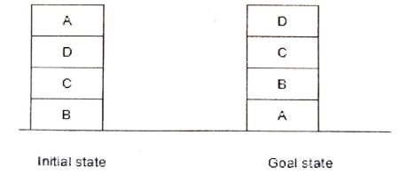

# Artificial Intelligence & Machine Learning ESE 
> Author : Aaron Augustine

> Star the gist so that I can get a consensus on how many people are using this resource
> 
[Github Repo Link for all ESE Notes](https://github.com/ToothlessRider/Sem_3_Notes.git)

# Table of Contents
1. [Previous Years Questions](#previous-year-questions)

## Syllabus
1. AZ Introduction
2. Heuristic Search
3. Hill climbing Search
4. A* algo and AO* algo
5. Min Max Strategy
6. Predicate Logic and Resolutions
7. Planning ( Graph Plan, SAT plan, Hybrid Research)
8. Belief networks
9. Decision tree
10. SVM

## Previous Year Questions

Q1. a.  **Convert the following statements into predicate logic.**
i) **All VJTI students are smart.**
ii) **Every student except George smiles.**
iii) **Anyone who loves everyone loves himself.**
iv) **Someone walks and someone talks.**

Ans. 

i) **All VJTI students are smart.**
Let:
- $V(x)$ : $x$ is a VJTI student.
- $S(x)$ : $x$ is smart.

**Predicate Logic:**  
$\forall x \, (V(x) \rightarrow S(x))$

---

ii) **Every student except George smiles.**
Let:
- $T(x)$ : $x$ is a student.
- $G$: George.
- $Sm(x)$ : $x$ smiles.

**Predicate Logic:**  
$\forall x \, (T(x) \land x \neq G \rightarrow Sm(x))$

---

 iii) **Anyone who loves everyone loves himself.**
Let:
- $L(x, y)$: $x$ loves $y$.

**Predicate Logic:**  
$\forall x \, \left( \left( \forall y \, L(x, y) \right) \rightarrow L(x, x) \right)$

---

iv) **Someone walks and someone talks.**
Let:
- $W(x)$ : $x$ walks.
- $T(x)$ : $x$ talks.

**Predicate Logic:**  
$\exists x \, W(x) \land \exists y \, T(y)$  
*(Note: $x$ and $y$ can be the same person or different individuals.)*

--- 

Q1. b. **Describe the Hill climbing algorithm with proper example? VVhat are the problems in Hill Climbing?**

Ans.

### **Hill Climbing Algorithm**

**Definition**:  
Hill climbing is an optimization algorithm that starts with an arbitrary solution to a problem and iteratively improves the solution by making incremental changes. The goal is to reach a peak or an optimal solution in the solution space.

---

### **Steps of the Hill Climbing Algorithm**:
1. Start with an initial solution (state).
2. Evaluate the neighboring states.
3. Move to the neighboring state with the best objective function value (higher value for maximization problems or lower for minimization).
4. Repeat steps 2 and 3 until:
   - A peak is reached (no better neighbors exist).
   - A pre-defined stopping condition is met (e.g., a maximum number of iterations).

---

### **Example**:

**Problem**: Maximize the function $f(x) = -(x-3)^2 + 9$ where $x$ is in the range [0, 6].

1. **Initialization**: Start at $x = 0$, where $f(0) = -(0-3)^2 + 9 = 0$.
2. **Neighbors**: Evaluate $f(x)$ at neighboring values (e.g., $x = 1, 2, \ldots, 6$).
3. **Step 1**: Move to $x = 1$ since $f(1) = -(1-3)^2 + 9 = 4$ is better than $f(0)$.
4. Continue moving to $x = 2$ ($f(2) = 8$) and $x = 3$ ($f(3) = 9$).
5. **Stop**: At $x = 3$, all neighboring values ($x = 2, 4$) have lower $f(x)$. Thus, $x = 3$ is the solution.

---

### **Problems in Hill Climbing**:

1. **Local Maxima/Minima**
2. **Plateau**
3. **Ridges**
4. **No Backtracking**
5. **Stochastic Nature**
6. **Search Space Dependency**

--- 

Q1. c. **What is Blocks World Problem? Apply the global heuristics and draw a tree to obtain the Goal state from the Initial state for the following problem.**

Ans. 

**Definition**
There is a table on which some blocks are placed. Some blocks may or may not be stacked on other blocks. We have a robot arm to pick up or put down the blocks. The robot arm can move only one block at a time, and no other block should be stacked on top of the block which is to be moved by the robot arm.
Our aim is to change the configuration of the blocks from the Initial State to the Goal State, both of which have been specified in the diagram below.

Given below are the list of predicates as well as their intended meaning
1. $ON (A, B)$ : Block A is on B
2. $ONTABLE(A)$ : A is on table
3. $CLEAR(A)$ : Nothing is on top of A
4. $HOLDING(A)$ : Arm is holding A.
5. $ARMEMPTY$ : Arm is holding nothing

---

The Robot Arm can perform 4 operations:
1. $STACK(X, Y)$ : Stacking Block X on Block Y
2. $UNSTACK(X, Y)$ : Picking up Block X which is on top of Block Y
3. $PICKUP(X)$ : Picking up Block X which is on top of the table
4. $PUTDOWN(X)$ : Put Block X on the table

*Initial State* : 
$ON(A,D)\land ON(D,C)\land ON(C,B)\land ONTABLE(B)$

*Operations* :
1. $UNSTACK(A)$
2. $UNSTACK(D)$
3. $UNSTACK(C)$
4. $STACK(B,A)$
5. $STACK(C,B)$
6. $STACK(D,C)$

*Goal State* : 
$ON(D,C)\land ON(C,B)\land ON(B,A)\land ONTABLE(A)$

--- 

Q1. d. **What is heuristics? Explain it with proper example.**

Ans. 

### **What is Heuristics?**

**Heuristics** use domain specific knowledge Heuristics use domain specific knowledge
to estimate the quality or potential of to estimate the quality or potential of
partial solutions partial solutions

Heuristics are widely used in **Artificial Intelligence (AI)**, **optimization problems**, and **search algorithms**, helping systems make decisions efficiently.

---

### **Characteristics of Heuristics**:
1. **Speed**: Faster than exhaustive methods.
2. **Approximation**: May not find the best solution but provides a satisfactory one.
3. **Domain-Specific**: Often tailored to a particular type of problem.
4. **Resource-Friendly**: Saves computational time and resources.

---

### **Examples of Heuristics**

#### **Example 2: Chess**  
**Problem**: Determine the next best move in a chess game.  
**Heuristic**: Minimax with evaluation functions:
- Assign scores to board positions based on factors like piece value, control of the center, and king safety.
- The algorithm uses these scores to choose a move that maximizes advantage while minimizing the opponent's opportunities.

**Advantage**: Helps make strategic moves without searching all possible outcomes.

---

### **Advantages of Heuristics**:
1. Quick decision-making.
2. Simplifies complex problems.
3. Reduces computational costs.

### **Disadvantages of Heuristics**:
1. May not find the optimal solution.
2. Can be biased if not designed carefully.
3. Success depends on the problem and domain.

---

### **Summary**
Heuristics are like educated guesses or shortcuts for problem-solving. While they do not guarantee optimal results, they are practical and efficient for many real-world applications.

---

Q2. a. **What is proof by resolution / refutation? Consider the following Co2 knowledge base. Apply resolution technique and draw a refutation tree to prove the Goal: If John is a child, then John carves Some pumpkin.**
1) Every child loves every candy.
2) Anyone who loves some candy is not a nutrition fanatic.
3) Anyone who eats any pumpkin is a nutrition fanatic.
4) Anyone who buys any pumpkin either carves It or eats it.
5) John buys a pumpkin.
6) Lifesavers is a candy.
7) (Conclusion) If John is a child, then John carves some
pumpkin.

Ans. 

### **What is Proof by Resolution / Refutation?**

Proof by **resolution** (or refutation) is a method in **propositional and first-order logic** to prove the validity of a statement. The approach involves:

1. **Negating the Goal**: Assume the negation of the goal statement is true.
2. **Converting to Clausal Form**: Express all knowledge base (KB) statements and the negated goal as **clauses** in Conjunctive Normal Form (CNF).
3. **Applying Resolution**: Repeatedly resolve pairs of clauses to derive new clauses.
4. **Refutation**: Arrive at a contradiction (empty clause), proving that the original goal must be true.

---

### **Problem Setup:**

#### **Knowledge Base (KB):**
1. **Every child loves every candy**:  
   $\forall x \, (\text{Child}(x) \rightarrow \forall y \, (\text{Candy}(y) \rightarrow \text{Loves}(x, y)))$.

2. **Anyone who loves some candy is not a nutrition fanatic**:  
   $\forall x \, (\exists y \, (\text{Candy}(y) \land \text{Loves}(x, y)) \rightarrow \neg \text{NutritionFanatic}(x))$.

3. **Anyone who eats any pumpkin is a nutrition fanatic**:  
   $\forall x \, (\exists y \, (\text{Pumpkin}(y) \land \text{Eats}(x, y)) \rightarrow \text{NutritionFanatic}(x))$.

4. **Anyone who buys any pumpkin either carves it or eats it**:  
   $\forall x \, \forall y \, (\text{Pumpkin}(y) \land \text{Buys}(x, y) \rightarrow (\text{Carves}(x, y) \lor \text{Eats}(x, y)))$.

5. **John buys a pumpkin**:  
   $\exists y \, (\text{Pumpkin}(y) \land \text{Buys}(\text{John}, y))$.

6. **Lifesavers is a candy**:  
   $\text{Candy}(\text{Lifesavers})$.

#### **Goal Statement**:  
**If John is a child, then John carves some pumpkin.**  
   $\text{Child}(\text{John}) \rightarrow \exists y \, (\text{Pumpkin}(y) \land \text{Carves}(\text{John}, y))$.

#### **Negated Goal**:  
$\text{Child}(\text{John}) \land \forall y \, (\text{Pumpkin}(y) \rightarrow \neg \text{Carves}(\text{John}, y))$.

---

### **Resolution Steps**:

#### 1. **Convert to Clausal Form**:
1. $\neg \text{Child}(x) \lor \neg \text{Candy}(y) \lor \text{Loves}(x, y)$.
2. $\neg \text{Candy}(y) \lor \neg \text{Loves}(x, y) \lor \neg \text{NutritionFanatic}(x)$.
3. $\neg \text{Pumpkin}(y) \lor \neg \text{Eats}(x, y) \lor \text{NutritionFanatic}(x)$.
4. $\neg \text{Pumpkin}(y) \lor \neg \text{Buys}(x, y) \lor \text{Carves}(x, y) \lor \text{Eats}(x, y)$.
5. $\text{Pumpkin}(P) \land \text{Buys}(\text{John}, P)$.
6. $\text{Candy}(\text{Lifesavers})$.
7. Negated Goal: $\text{Child}(\text{John}) \land (\neg \text{Carves}(\text{John}, P))$.

#### 2. **Resolution**:
Using clauses, systematically resolve:
1. From $\neg \text{Child}(\text{John}) \lor \dots$ and $\text{Child}(\text{John})$, derive constraints.
2. Use $\text{Pumpkin}(P)$ and $\neg \text{Pumpkin}(y) \lor \dots$.
3. Derive $\neg \text{Eats}(\text{John}, P)$ and simplify further.
4. Combine $\text{Carves}(\text{John}, P) \lor \text{Eats}(\text{John}, P)$ with constraints.

#### 3. **Refutation Tree**:
Each resolution step narrows down possibilities, eventually deriving an empty clause. **The Goal is proven true**.

---

Q2. b. **Explain A\* algorithm and perform the A\* algorithm on the following graph.**

Ans. 

### **What is the A\* Algorithm?**

The **A\*** (A-star) algorithm is a search algorithm used for finding the shortest path from a start node to a goal node in a weighted graph. It combines elements of **Dijkstra’s Algorithm** (which focuses on the shortest path) and **Greedy Best-First Search** (which uses heuristics) to make an informed decision at each step.

---

### **Key Concepts in A\***:
1. **Cost Function**:  
   $f(n) = g(n) + h(n)$  
   - $f(n)$: Total estimated cost of the path through node $n$.
   - $g(n)$: Cost to reach node $n$ from the start node.
   - $h(n)$: Heuristic estimate of the cost to reach the goal from $n$.

2. **Optimality**: A\* guarantees the shortest path if $h(n)$ is an **admissible heuristic**, meaning it never over-estimates the actual cost.

3. **Algorithm Steps**:
   1. Initialize an **open list** (nodes to be explored) and a **closed list** (nodes already explored).
   2. Add the start node to the open list.
   3. While the open list is not empty:
      - Select the node with the lowest $f(n)$ value.
      - If it is the goal node, return the path.
      - Otherwise, expand the node and update $g(n)$, $h(n)$, and $f(n)$ values for its neighbors.
      - Move the current node to the closed list.
   4. Repeat until the goal is reached or the open list is empty.

---

**Heuristics** ( $h(n)$ ):  
| **Node** | **Heuristic ($h$)** |
|----------|-------------------------|
| $S$  |        11.5        |
| $A$  | 10.1                      |
| $B$  | 5.8                       |
| $C$  | 3.4                       |
| $D$  | 9.2                      |
| $E$  | 7.1                       |
| $F$  | 3.5                     |
| $G$ | 0 | 

**Goal**: Find the shortest path from $S$ to $G$.

| $S -> A$ | $S -> D$ |
| -- | -- |
| $3+10.1$ | $4+9.2$ | 
| $13.1$ | $13.2$ | 

- So we will go along $SA$

| $SA -> B$ | $SA-> D$ |
| -- | -- |
| $3+4+5.8$ | $3+5+9.2$ | 
| $12.8$ | $18.2$ | 
- So we will go along $SAB$

| $SAB -> C$ | $SAB-> E$ |
| -- | -- |
| $3+4+5+7.1$ | $3+4+4+3.4$ | 
| $19.1$ | $14.1$ |
- But since $SABE$ is a dead end we will go back to $S->D$

| $SD -> E$ | $SD-> A$ |
| -- | -- |
| $4+2+7.1$| $4+5+10.1$ | 
| $13.1$ | $19.1$ | 
- So we will go along $SDE$ 

| $SDE -> F$ | 
| -- | 
| $4+2+4+3.5$| 
| $13.5$ | 
- The last node left to traverse is $G$ 

| $SDEF -> G$ | 
| -- | 
| $4+2+4+3.5+0$| 
| $13.5$ | 

--- 

### **Example Problem: A\* on a Graph**

#### **Graph Setup**:
Nodes: $A, B, C, D, E, F$.  
Edges: Weighted connections between nodes.  
Heuristics: $h(n)$ values for each node representing the estimated distance to the goal node.

#### **Graph Details**:
| **Edge**     | **Weight** |
|--------------|------------|
| $A \to B$ | 1          |
| $A \to C$ | 4          |
| $B \to C$ | 2          |
| $B \to D$ | 5          |
| $C \to D$ | 1          |
| $D \to E$ | 3          |
| $C \to F$ | 6          |
| $F \to E$ | 1          |

**Heuristics** ( $h(n)$ ):  
| **Node** | **Heuristic ($h$)** |
|----------|-------------------------|
| $A$  | 7                       |
| $B$  | 6                       |
| $C$  | 2                       |
| $D$  | 1                       |
| $E$  | 0                       |
| $F$  | 4                       |

**Goal**: Find the shortest path from $A$ to $E$.

---

### **A\* Algorithm Execution**

#### **Step 1: Initialization**
- Open list: $\{A\}$.
- Closed list: $\emptyset$.
- $g(A) = 0$, $f(A) = g(A) + h(A) = 7$.

#### **Step 2: Explore $A$**
- Expand neighbors: $B$, $C$.
- Calculate costs:
  - $g(B) = 1$, $f(B) = g(B) + h(B) = 7$.
  - $g(C) = 4$, $f(C) = g(C) + h(C) = 6$.
- Open list: $\{B, C\}$.  
- Closed list: $\{A\}$.

#### **Step 3: Explore $C$**
- Expand neighbors: $D$, $F$.
- Calculate costs:
  - $g(D) = 4 + 1 = 5$, $f(D) = g(D) + h(D) = 6$.
  - $g(F) = 4 + 6 = 10$, $f(F) = g(F) + h(F) = 14$.
- Open list: $\{B, D, F\}$.  
- Closed list: $\{A, C\}$.

#### **Step 4: Explore $D$**
- Expand neighbors: $E$.
- Calculate costs:
  - $g(E) = 5 + 3 = 8$, $f(E) = g(E) + h(E) = 8$.
- Open list: $\{B, F, E\}$.  
- Closed list: $\{A, C, D\}$.

#### **Step 5: Explore $E$**
- Goal node reached.  
- Shortest path: $A \to C \to D \to E$.  
- Total cost: $8$.

---

Q2. c. **Differentiate between GraphPlan and SATPlan**

Ans. 
GraphPlan and SATPlan are both classical planning algorithms used in artificial intelligence to solve planning problems, but they differ in their underlying approaches and methods.

| | GraphPlan | SATPlan |
| -- | -- | -- |
|Approach | It is a forward-chaining, graph-based planning algorithm. It operates by constructing a planning graph representing possible states and actions  | SATPlan is a planning algorithm based on Boolean satisfiability (SAT) solvers. It encodes planning problems into propositional logic and utilizes SAT solvers to search for a satisfying assignment of the encoded problem.| 
| Representation | This graph alternates between levels of actions and states, and it continues to expand until a solution is found. |It transforms the planning problem into a Boolean satisfiability problem by encoding states, actions, and their relationships as logical formulas. |
| Completeness | GraphPlan is guaranteed to find a solution if one exists in a finite space| Similar to GraphPlan, SATPlan is also complete and hence will find a solution if one exists within the given encoding and problem space.| 
| Advantages |  It tends to be efficient in certain types of problems and can handle concurrent actions well.| SATPlan can handle problems with a large number of variables and constraints more effectively |

--- 

Q3. a. **What is bayesian belief network? Consider the following Bayesian Belief Network. Find the following probabilities.**
i) $P(Tamperingl|Report)$
ii) $P(Fire|Smoke)$
iii) $P(Tampering|Report \wedge Smoke)$
iv)$P(Fire|Report \wedge  Smoke)$

Ans. 

---

Q3.b. **What is the AO\* Search Algorithm ? Solve the following question**

Ans. 

> Reference : [AO* Algorithm](https://www.youtube.com/watch?v=mtSn_Lh750g&t=73s)

### What is AO* Algorithm ?

- AO* is a heuristic search algorithm in AI
- it uses the concept of **AND-OR** graphs to decompose any complex problem given into smaller set of problems which are further solved. 

#### Working of the AO* algorithm 

- It uses the following formula : 
  - $f(n) = g(n) + h(n)$ 
- where :
  - $g(n)$ = Actual cost of traversal from *Initial* to *Current* state
  - $h(n)$ = Estimated cost of traversal from *Current* to the *Goal* state
  - $f(n)$ = Actual cost of traversal from *Initial* to *Goal* state

**Question Solving**
---

---

## Important Topics

Q1. **What is Situation Calculus ?**

Ans. Situation Calculus is a method of representing planning problems. It is based on first-order logic and is particularly useful in describing actions, their effects, and the evolution of the world state.

*Initial state*:
$At(Home, s0) \land \lnot Have(Tea, s0) \land
\lnot Have(Biscuits, s0) \land \lnot Have(Book, s0)$

*Goal state*:
$\exists s At(Home, s) \land Have(Tea, s)  land Have(Biscuits, s) \land Have(Book, s)$

---

Q2.**What is Skolemization? Explain with proper examples.**			

Ans:

Skolemization is a transformation of first-order logic formulae, which removes all existential quantifiers from a formula. The basic idea is to replace existential quantifiers with Skolem functions, which are new functions that depend only on universally quantified variables. This transformation simplifies the logical expression and often makes it easier to work with.
**Example**: 
Consider the statement: "There exists a teacher who teaches all courses."
Symbolically: $∃x ∀y Teaches (x, y)$
x represents a teacher.
y represents a course.
Teaches (x, y) means "teacher x teaches course y."

Skolemization:
Introduce a new function symbol, say, Teacher, that depends only on universally quantified variables.
Symbolically: $∀y Teaches (Teacher (), y)$
Teacher () represents a specific teacher introduced by the Skolemization process.
The statement ∀y Teaches (Teacher (), y) means "the teacher represented by Teacher () teaches all courses y."

So, Skolemization essentially transforms statements with existential quantifiers into equivalent statements without them, making the logic more manageable and facilitating reasoning.

--- 
