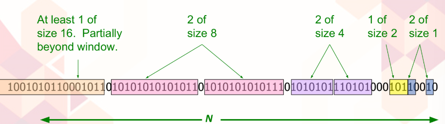
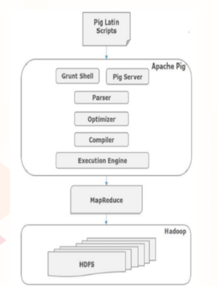

#  Big Data ESE 
> Author : Aaron Augustine

> Star the gist so that I can get a consensus on how many people are using this resource
> 
[Github Repo Link for all ESE Notes](https://github.com/ToothlessRider/Sem_3_Notes.git)

# Table of Contents
- [Big Data ESE](#big-data-ese)
- [Table of Contents](#table-of-contents)
  - [Previous Year Questions](#previous-year-questions)
  - [Pig hive PPT](#pig-hive-ppt)
    - [MapReduce](#mapreduce)
    - [Pig](#pig)
      - [Applications of Apache Pig](#applications-of-apache-pig)
    - [Apache Pig vs MapReduec](#apache-pig-vs-mapreduec)

## Previous Year Questions

Q1. a. **Discuss the functions of each of the five layers in Big Data architecture design.**

Ans. 
Big Data architecture typically involves five key layers that work together to process, store, and analyze vast amounts of data. Here's a detailed breakdown of the functions of each layer:

---

#### **1. Data Ingestion Layer**
   - **Function**: Responsible for collecting and importing data from various sources into the Big Data system.
   - **Key Features**:
     - Supports batch data ingestion (periodic imports) and real-time streaming.
     - Handles data from structured, semi-structured, and unstructured sources, such as databases, APIs, IoT devices, logs, and social media.
     - Includes mechanisms for error handling, data filtering, and format conversion.
   - **Examples**:
     - Tools: Apache Kafka, Apache Flume, Apache NiFi, AWS Kinesis.
     - Sources: Relational databases, sensors, files, or message queues.

---

#### **2. Data Storage Layer**
   - **Function**: Ensures the ingested data is stored in a secure and scalable manner, making it accessible for processing.
   - **Key Features**:
     - Accommodates the storage of structured, semi-structured, and unstructured data.
     - Provides distributed and fault-tolerant storage to prevent data loss.
     - Optimized for both long-term storage and quick retrieval for processing.
   - **Examples**:
     - Hadoop Distributed File System (HDFS), AWS S3, Google Cloud Storage.
     - NoSQL Databases: MongoDB, Cassandra, HBase.
     - Relational Databases: MySQL, PostgreSQL.

---

#### **3. Data Processing Layer**
   - **Function**: Processes the raw data to transform it into a usable format for analysis or storage.
   - **Key Features**:
     - Supports **batch processing** for large-scale data transformations and **real-time processing** for immediate insights.
     - Includes operations like filtering, sorting, aggregating, and cleaning.
     - Implements distributed computing to process data efficiently at scale.
   - **Examples**:
     - Batch Processing: Apache Hadoop (MapReduce), Apache Spark.
     - Real-Time Processing: Apache Flink, Apache Storm.

---

#### **4. Data Analytics Layer**
   - **Function**: Extracts insights, patterns, and intelligence from processed data.
   - **Key Features**:
     - Performs advanced analytics such as machine learning, predictive modeling, and statistical analysis.
     - Supports querying, reporting, and data mining.
     - Provides APIs or tools for analysts and data scientists to explore and experiment.
   - **Examples**:
     - Tools: Apache Spark (MLlib), TensorFlow, Python libraries (Pandas, Scikit-learn).
     - BI Platforms: Tableau, Power BI, QlikView.

---

#### **5. Data Visualization and Access Layer**
   - **Function**: Makes the insights accessible and interpretable for business users and decision-makers.
   - **Key Features**:
     - Generates dashboards, reports, and visual representations of data such as charts, graphs, and maps.
     - Provides interfaces for querying data interactively (e.g., SQL-like interfaces).
     - Ensures data is accessible via APIs for integration with external systems.
   - **Examples**:
     - Visualization Tools: Tableau, Kibana, Power BI.
     - Data Access: RESTful APIs, SQL-on-Hadoop tools like Hive or Impala.

---

#### **Integration Across Layers**
- These layers work seamlessly together in a pipeline:
  1. **Data Ingestion Layer** collects data.
  2. **Data Storage Layer** organizes and stores the data.
  3. **Data Processing Layer** transforms raw data into usable formats.
  4. **Data Analytics Layer** generates insights from the processed data.
  5. **Data Visualization and Access Layer** delivers the insights in a user-friendly way.

--- 

Q1. b. **Explain the nature of data and it's application**

Ans. 
1. **Data Complexity**: In healthcare, Big Data analytics can integrate complex patient records, medical images, and genetic data to provide personalized treatment plans and predict disease outbreaks.
2. **Data Uniqueness**: Social media platforms leverage the unique nature of user-generated content to provide personalized recommendations, targeted advertising, and sentiment analysis for business insights.
3. **Data Temporality**: Financial institutions use real-time data feeds to detect fraudulent transactions, monitor stock market fluctuations, and adjust investment strategies swiftly.
4. **Data Immutability**: Legal and compliance departments use immutable data logs for auditing purposes, ensuring the integrity and traceability of financial transactions, legal contracts, and regulatory compliance.
5. **Data Bias**: Data bias in criminal justice refers to using Big Data to analyse past arrest and sentencing information to find and fix unfair patterns in law enforcement and judicial decision-making.

---

Q1. c. **With an example, explain the strategy for placement of blocks in HDFS.**

Ans. 

---

Q1. d. **With a neat diagram explain the HDFS architecture and its working.**

Ans. 

#### 1. **NameNode**
- The NameNode runs on commodity hardware with the GNU/Linux operating system and the NameNode software.
- It acts as the master server and performs the following tasks:
- Manages the file system namespace.
- Regulates client access to files.
- Executes file system operations such as renaming, closing, and opening files and directories.

#### 2. **DataNode**:
- Each DataNode also runs on commodity hardware with the GNU/Linux operating system and the DataNode software.
- For every node in the cluster, there will be a corresponding DataNode.
- DataNodes manage data storage and perform the following operations:
- Handle read-write operations on the file system based on client requests.
- Execute block creation, deletion, and replication according to instructions from the NameNode.
  
#### 3. **Block**:
- User data in HDFS is stored in files, which are divided into segments known as blocks.
- Each block represents the minimum amount of data that HDFS can read or write.
- The default block size is 64 MB, but it can be adjusted based on specific needs through HDFS configuration.

---

Q2. a. **Define data streams. Bring out the challenges faced by data streams. Giveany two application of data stream.**

Ans. 
#### **Definition of Data Streams**
A **data stream** is a continuous, real-time, and potentially infinite flow of data generated from various sources, such as sensors, log files, financial transactions, social media, or IoT devices. Unlike static datasets, data streams are dynamic and require immediate processing to extract valuable insights.

---

#### **Challenges Faced by Data Streams**
1. **High Velocity and Volume**:
   - Data streams arrive at high speed and in large quantities

2. **Infinite Nature**:
   - Their theoretically indefinite nature makes storing it all impractical.

3. **Real-Time Processing**:
   - To understand the data it needs immediate processing, which can be computationally demanding.

4. **Data Heterogeneity**:
   - Streams may consist of structured, semi-structured, and unstructured data.

5. **Handling Data Quality**:
   - Streams may include noisy, missing, or corrupted data.

6. **Fault Tolerance**:
   - Ensuring reliability in case of  node or network failures is important.
7. **Limited Memory**:
   - Processing systems will have limited memory and hence we need to use methods like **windowing**, etc.

8. **Out-of-Order Data**:
   - Events might not arrive in the sequence they occurred, complicating analysis and aggregation.

9. **Security and Privacy**:
   - Streams often contain sensitive information, requiring secure transmission and processing.

10. **Scalability**:
    - Systems must scale seamlessly to accommodate fluctuating stream loads.

---

#### **Applications of Data Streams**

##### 1. **Fraud Detection in Financial Systems**
   - **Description**: Real-time monitoring of financial transactions to identify and flag unusual or fraudulent activities.
   - **Example**: Credit card companies using streaming data to detect and prevent fraudulent transactions.

##### 2. **IoT Sensor Monitoring**
   - **Description**: Continuous monitoring of IoT devices and sensors for applications like predictive maintenance, environmental monitoring, or smart homes.
   - **Example**: Smart thermostats analyzing temperature and humidity data in real time to adjust settings automatically.

---

Q2. b. **Briefly explain the working of DGIM method. If needed, explain with an example for the same.**

Ans. 

#### DGIM ( Datar-Gionis-Indyk-Motwani)
The **DGIM (Datar-Gionis-Indyk-Motwani)** method is used to estimate the number of 1s in the last $n$ bits of a binary stream using limited memory. It operates by maintaining a compact summary of the stream using **buckets**.

---

#### **Working of DGIM Method**
1. **Stream Bucketing**:
   - Group 1s into *buckets*, each represented by its size and timestamp of the most recent 1.

2. **Bucket Rules**:
   - Each bucket has a size that is a power of 2 (e.g., 1, 2, 4, ...).
   - Maintain at most two buckets of each size for efficiency.
   - Buckets merge when a third bucket of the same size is created.

3. **Updating Buckets**:
   - On a new bit:
     - If it's 0: Do nothing.
     - If it's 1: Create a new bucket of size 1 with the current timestamp.
     - Merge buckets if needed to adhere to the two-bucket rule.

4. **Query Estimation**:
   - To estimate the number of 1s in the last $n$ bits:
     - Sum the sizes of buckets within $n$ bits.
     - Include the *partial contribution* of the oldest bucket if it extends beyond $n$.

---

##### **Example**
Consider a binary stream: `101101`.

1. **Step 1**:
   - First bit (1): Create bucket [1, t1].
   - Second bit (0): No action.
   - Third bit (1): Create bucket [1, t3].
   
2. **Step 2 (Merge)**:
   - Two size-1 buckets: Merge them into [2, t3].

3. **Step 3 (Continued Stream)**:
   - Process additional bits, creating and merging buckets as per rules.

---

#### **Advantages**
- Memory-efficient with $O(\log n)$ buckets.
- Approximate results with bounded error (at most 50%).

The DGIM method effectively tracks recent 1s in streams where exact counting is impractical.

---

Q2. c. **Describe the various ways of sampling the data streams. Explain the why sampling is important here.**

Ans. 

---

Q3. a. **Apply the aprori algorithm for discovering frequent item sets to the following datasets: (support value is 2 )**

| TransID | item Purchased | 
| -- | -- |
| 101 | Kiwi, Grapes, Star fruit | 
| 102 | Kiwi, Gooseberry | 
| 103 | Star fruit, Gooseberry |
| 104 | Kiwi, Grapes, Star fruit, lemon | 
| 105 | Lemon, Starfruit |
| 106 | Kiwi, Grapes, Star fruit | 

Check which of the following rules can be selected (if mininum confidence is 60%)
a) $\{Kiwi, Graphes\}.->\{ Kiwi, Grapes, Starfruit\}$
b) $\{Kiwi\} ->\{Grapes, Starfruit\}$ 
c) $\{Grapes\} -> \{Starfruit, Kiwi\}$
Ans. 

---

Q3. b. **Consider the following sentences**
**D1: I am writing.**
**D2: Sam is writing assignment.**
**D3: I could solve all questions of assignment.** **Calculate Jaccard's similarity for following**
a) Shingles with (k-2) for each of $D1, D2$ 
b) Shingles with (k=2) for $D1 U D3$
c) Shingles with (k-3) but at character level for D1 U D2 

Ans. 

---

Q3. c. **Give an algorithm to explain the working of min hashing Function.**

Ans. 

---

Q4. a. **Explain how the tasks are schedule in Map Reduce.**

Ans. 

---

Q4. b.**Write in detail the concept of developing the Map Reduce Application to find the occurrences of a word.**

Ans.
The MapReduce algorithm is a parallel data processing framework that efficiently processes large datasets by dividing them into smaller chunks and distributing the processing across a cluster of computers. Let's elaborate on the MapReduce algorithm with an example:

**Problem Statement**: Suppose we have a large collection of text documents, and we want to
count the frequency of each word across all documents.
#### Map Phase:
• In the Map phase, we break down the problem into smaller tasks.
• Each task is responsible for processing a portion of the input data.
• We define a map function that takes an input record (in this case, a document) and emits key-value pairs.
• The key represents a word in the document, and the value is set to 1 to indicate that the word was encountered once in this document.
**Eg.**
Input: "Hello world! Hello MapReduce."
Output:
("Hello", 1)
("world!", 1)
("Hello", 1)
("MapReduce", 1)

#### Shuffle and Sort Phase:
• After the Map phase, the framework collects all emitted key-value pairs and performs a shuffle and sort operation.
• During this phase, all key-value pairs with the same key are grouped together and sorted.
• This is essential to ensure that all occurrences of a word are processed together in the Reduce phase.
**Eg.**
("Hello", [1, 1])
("MapReduce.", [1])
("world!", [1])

#### Reduce Phase:
• In the Reduce phase, we define a reduce function that takes a key and a list of values.
• The key represents a unique word, and the list of values contains the counts of that word
from different documents.
• The reduce function aggregates the values for each key to calculate the total frequency of
that word across all documents.
**Eg.**
Input for key "Hello": [1, 1]
Output: ("Hello", 2)
Input for key "MapReduce.": [1]
Output: ("MapReduce.", 1)
Input for key "world!": [1]
Output: ("world!", 1)
#### Final Output:
**("Hello", 2)**
**("MapReduce.", 1)**
**("world!", 1)**

---

Q4. c. **Explain the role of map and reduce to execute the following relational operations.**
a) Union
b) Intersection

Ans. 

---

Q4. d. **How are failures handled in map reduce?**

Ans. 

- Data loss prevention
  - By keeping multiple copies of data in different machines
- Data movement minimization
  - By moving computation to the data
  - (send your computer program to machines containing data)
- Simple programming model
  - Mainly two functions
    - Map
    - Reduce
- Programmer’s responsibility
  - Write only two functions, map and reduce suitable for your problems
  - Do not worry about other things

#### **1. Map Task Failures**
Map task failures occur during the execution of map tasks, which process input data and generate intermediate key-value pairs.

##### **Causes of Map Task Failures**
1. **Hardware Failures**:
   - Node crashes, disk failures, or power outages.
2. **Software Issues**:
   - Bugs in user-defined map code (e.g., NullPointerException, runtime errors).
3. **Data Corruption**:
   - Input data is corrupted or unreadable.
4. **Timeouts**:
   - A map task takes too long without reporting progress (e.g., due to infinite loops or resource contention).

##### **Handling Mechanisms**
- **Task Retry**:
  - The failed map task is retried automatically on another node.
  - By default, tasks are retried up to four times in Hadoop (configurable).
- **Speculative Execution**:
  - If a map task is slow (but not yet failed), a duplicate task is launched on another node. The faster of the two completes, and the slower one is killed.
- **Data Replication**:
  - Input data in HDFS is replicated (default replication factor is 3). If a task fails due to corrupted data on one node, it is re-executed on another node using a healthy replica.
- **Timeout Recovery**:
  - If a map task fails to make progress within the timeout period, it is assumed to have failed and is rescheduled.

---

#### **2. Job Failures**
A **job failure** occurs when the entire MapReduce job cannot complete successfully. This could happen due to persistent map task failures or issues in the overall execution framework.

##### **Causes of Job Failures**
1. **Repeated Task Failures**:
   - A task exceeds the retry limit (e.g., persistent code bugs or corrupted input data).
2. **Resource Exhaustion**:
   - Insufficient memory, CPU, or disk space for tasks.
3. **Master Node Failures**:
   - The failure of the JobTracker (Hadoop 1.x) or ApplicationMaster (Hadoop 2.x/YARN).
4. **Input/Output Errors**:
   - Missing or inaccessible input data, or issues writing final output.
5. **Configuration Errors**:
   - Incorrect job configuration parameters.

##### **Handling Mechanisms**
- **Abort After Max Retries**:
  - If a task fails beyond its retry limit, the entire job is aborted. The failure is logged, and the user is notified.
- **Master Node Recovery**:
  - In YARN (Hadoop 2.x), the ApplicationMaster can restart and resume jobs using checkpointed progress.
- **Graceful Exit and Cleanup**:
  - Failed jobs ensure proper cleanup of temporary files and resources (e.g., intermediate data or reserved cluster slots).
- **User Notification**:
  - Detailed logs and error messages are provided to help users debug the failure.

---

Q5. a. **Explain the Pig architecture with the help of a diagram.**

Ans. 
Apache Pig is a platform for processing and analyzing large data sets. It provides a high-level scripting language, Pig Latin, that abstracts the complexity of MapReduce programming. Its architecture can be divided into several components, each playing a distinct role in the data processing pipeline.

### **Pig Architecture Components**

1. **Pig Latin Scripts**:
   - **Function**: Users write data transformation and processing logic in the Pig Latin scripting language. 
   - **Input**: High-level Pig Latin commands.

2. **Parser**:
   - **Function**: Checks the syntax and semantics of the Pig Latin script.
   - **Output**: A logical plan, representing the script as a directed acyclic graph (DAG) of logical operators.

3. **Optimizer**:
   - **Function**: Optimizes the logical plan by applying transformations like merging operators and reordering joins to improve efficiency.
   - **Output**: An optimized logical plan.

4. **Compiler**:
   - **Function**: Translates the optimized logical plan into a series of MapReduce jobs or other execution plans (e.g., Tez or Spark).
   - **Output**: Physical execution plan.

5. **Execution Engine**:
   - **Function**: Executes the physical plan on the underlying processing engine (typically Hadoop's MapReduce, Tez, or Spark).
   - **Input**: Physical plan generated by the compiler.
   - **Output**: Results of data processing.

6. **Hadoop Distributed File System (HDFS)**:
   - **Function**: Acts as the default storage for input and output data.
   - **Input**: Raw data files.
   - **Output**: Processed results, stored back in HDFS.

7. **Pig Interfaces**:
   - **Grunt Shell**: Interactive shell for executing Pig commands and scripts.
   
---

### **Diagram: Pig Architecture**

---

Q5. b. **Write the syntax for the following in Hive, explaining the various keywords and its roles.**
a) Alter Table
b) Load Table

Ans. 

---

Q5. c.  **Bring out the various file formats supported by Hive.**

Ans. 
In Hive, the storage format refers to how the data is stored physically on the underlying file system. Hive supports various file formats, and the choice of storage format can have an impact on performance, compression, and query processing. Some of the commonly used storage formats in Hive include:
1. **TextFile**:
TextFile is a plain text format where each line in the file represents a record. Fields within a record are typically delimited by a specific character, such as a comma or a tab.

*Pros*: Human-readable, simple, and easy to work with.
*Cons*: Inefficient for certain query types, lacks built-in compression, and may not be optimal for large- scale data processing.

2. **SequenceFile**:
SequenceFile is a binary file format used for storing key-value pairs. It is a common Hadoop file format that supports both compression and splitting.

*Pros*: Binary format for efficient storage and processing, supports compression, and is splittable for parallel processing.
*Cons*: Not human-readable.

3. **ORC (Optimized Row Columnar)**:
ORC is a columnar storage format designed for high performance. It organizes data by columns rather than rows, providing better compression and faster query processing.

*Pros*: Excellent compression, predicate pushdown (filters applied during read), and improved performance for analytical queries.
*Cons*: Not human-readable, may have slightly higher write times compared to other formats.

4. **Parquet**:
Parquet is a columnar storage format similar to ORC, designed to be highly efficient for both storage and processing. It is an open standard format supported by various big data processing frameworks.

*Pros*: Excellent compression, support for nested data structures, and good performance for analytical queries.
*Cons*: Not human-readable.

5. **Avro**:
Avro is a binary serialization format that supports schema evolution. It is row-based and allows for flexible schema changes over time.

*Pros*: Compact binary format, supports schema evolution, and can be used for serializing complex data structures.
*Cons*: Not as optimized for query performance as columnar storage formats.

---

Q5. d. **Explain the various Pig Latin data formats.**

Ans. 

---

## Pig hive PPT

Hadoop has 4 main languages used in it : 
1. **Java** : This is Hadoops native language ( Hadoop was written in Java)
2. **Pig** : This is the Query and Workflow language
3. **Hive**: This is the  SQL based Language 
4. **HBase** : Column Oriented database for MapReduce

--- 

### MapReduce 
MapReduce has a lot of real world appeal because of three mani factors : 
1. Scalability : It is highly scalable due to simpler design 
2. Affordability : Runs on cheap commodity hardware 
3. Procedural Control : A processing "pipe".

**Disadvantage**
1. Data Rigidity
2. Hand coding operations
3. Hidden Semantics 

Hence we need to use a higher level Data Flow language, i.e. **Pig Latin**

### Pig 
> What is Pig ? 
- It's a language developed by yahoo and a top level Apache project
- You can access data on a cluster using *Pig Latin* 
- It interprets Pig latin and generates MapReduce jobs that will run the cluster
- easy data summarization

#### Applications of Apache Pig 
1. To process huge data sources

---

### Apache Pig vs MapReduec

|Point | Apache pig | Map Reduce | 
| -- | -- | -- | 
| Type | Apache pig is a Data Flow language | Map Reduce is a data processing paradigm | 
| Language | High level lang | Low level lang and rigid | 
| Joins | Easy to perform a Join | hard to perform a Join b/w datasets | 
| Domain | Need basic SQL knowledge to use | Need high level Java knowledge | 
| LOC | Uses Multi-Query approach which reduecs LOC | Needs 20 times the LOC to perform same task | 
| Compilation | No need for compilation | Long Compilation process | 