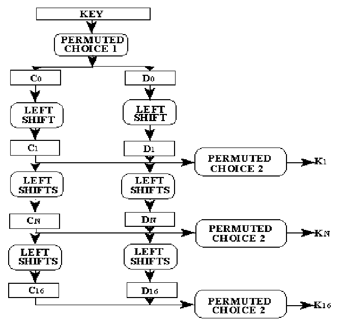
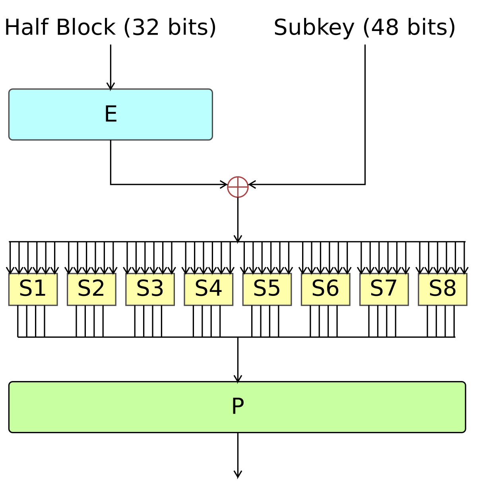
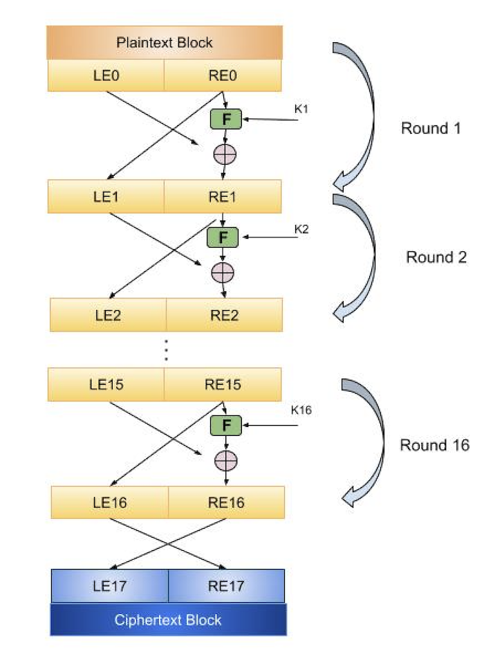
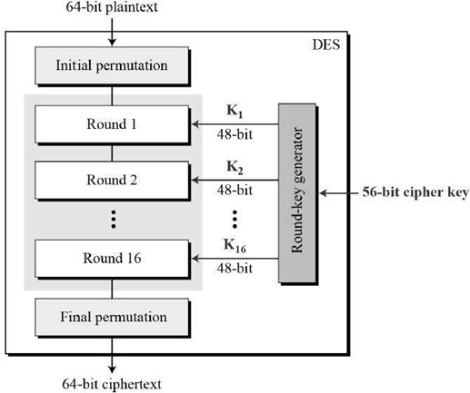
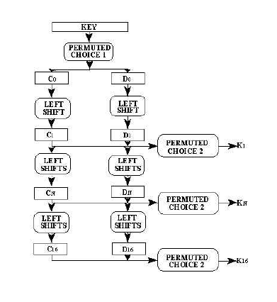

# Cryptography & Network Security ESE 
> Author : Aaron Augustine

> Star the gist so that I can get a consensus on how many people are using this resource
> 
[Github Repo Link for all ESE Notes](https://github.com/ToothlessRider/Sem_3_Notes.git)

## Table of Contents
1. [Previous Years Questions](#previous-year-questions)

## Previous Year Questions

**Q1. a. How are the keys generated for the Data Encryption Standard algorithm? Explain in detail.**

**Ans.**
#### **Key Generation in Data Encryption Standard (DES)**

The DES algorithm uses a 64-bit key as input, but only 56 bits are actually used for encryption (the remaining 8 bits are used for parity checks). The process of key generation involves the following steps:

**Steps in Key Generation**

1. **Initial Key Permutation (PC-1)**:
   - A 64-bit input key undergoes the **Permuted Choice 1 (PC-1)** operation, which selects and permutes 56 bits from the original key.  
   - The 8 parity bits are discarded.

   **Example**:  
   Input Key: `10101010 00110011 11110000 00001111 11111111 00000000 10101010 01010101`  
   After PC-1: `1111000...` (56 bits selected and permuted).

2. **Splitting the Key**:
   - The 56-bit key is divided into two halves, each of 28 bits:  
     **Left Half (C0)** and **Right Half (D0)**.

3. **Key Shifting**:
   - For 16 rounds of DES, the halves are cyclically shifted to the left (either 1 or 2 bits, depending on the round).  
   - Example: For Round 1, both halves are shifted by 1 bit.

4. **Permuted Choice 2 (PC-2)**:
   - After the shifts, **Permuted Choice 2 (PC-2)** selects and permutes 48 bits from the 56-bit key (28 bits from each half) to generate the **subkey** for each round.

**Key Schedule**
- **16 Subkeys** ($K_1, K_2, ..., K_{16}$ ):  
   - A unique 48-bit subkey is generated for each round using the process described above.  
   - Subkeys are used in each round of the Feistel structure of DES.

**Summary of Key Generation**
1. **Input**: 64-bit key.
2. **PC-1**: Reduces to 56 bits and permutes.
3. **Splitting**: Divides into 28-bit halves.
4. **Shifts**: Left shifts applied to halves.
5. **PC-2**: 48-bit subkeys derived for 16 rounds.

**Example** (Simplified for Clarity)
- Input Key: `64-bit binary`
- PC-1 Output: `56-bit binary`
- After Round 1 Shift: `Shifted halves (28-bit each)`
- PC-2 Output (Subkey for Round 1): `48-bit binary`

---

**Q1. b. Explain Shannon’s notion of perfect secrecy. What is one-time pad?**

**Ans.**

#### **Shannon’s Notion of Perfect Secrecy**
1. **Definition**: A cryptosystem achieves perfect secrecy if the ciphertext reveals no information about the plaintext, regardless of computational power.
2. **Mathematical Condition**:  
   $P(M | C) = P(M)$ 
   - $M$: Plaintext  
   - $C$: Ciphertext  
   This means the probability of the plaintext $M$ given the ciphertext $C$ is the same as the a priori probability of $M$.
3. **Key Requirement**:  
   - The key must be truly random, as long as the plaintext, and used only once.

**One-Time Pad (OTP)**
1. **Overview**:  
   - A method of encryption using a random key as long as the plaintext.  
   - The plaintext is XORed with the key to produce the ciphertext.
2. **Security**:  
   - If the key is truly random, never reused, and kept secret, OTP provides perfect secrecy.

**Example of One-Time Pad**
- **Plaintext** (M): "HELLO"  
   (ASCII: H = 72, E = 69, L = 76, L = 76, O = 79)
- **Key**: Random values (e.g., 19, 55, 62, 43, 91)
- **Encryption**: XOR plaintext with the key:  
   $C = M \oplus K$ 
   - For "H" (72): $72 \oplus 19 = 91$  
   - For "E" (69): $69 \oplus 55 = 114$  
   - Continue for all characters.
- **Ciphertext**: 91, 114, ...

---

**Decryption**: XOR ciphertext with the same key:  
   $M = C \oplus K$ 
This restores the original plaintext.

**Q1. c. What is key space, public keys, private keys, and setup in the ElGamal cryptosystem?**

**Ans.**
#### **Key Space, Public Keys, Private Keys, and Setup in the ElGamal Cryptosystem**
**Key Space**
1. **Definition**: The set of all possible keys that can be used in the cryptosystem.  
2. **ElGamal Key Space**:  
   - Private Key ($a$ ): Any random number in $\{1, 2, ..., p-2\}$ , where $p$  is a large prime.  
   - Public Key: Computed using $a$ , generator $\alpha$ , and prime $p$ .

**Public Keys**
1. **Definition**: Keys used to encrypt messages, shared publicly.  
2. **ElGamal Public Key Components**:  
   - Prime $p$ .  
   - Generator $\alpha$  (a primitive root modulo $p$ ).  
   - Computed value $\beta = \alpha^a \mod p$ , where $a$  is the private key.

 **Private Keys**
1. **Definition**: Keys used to decrypt messages, kept secret by the recipient.  
2. **ElGamal Private Key**:  
   - A secret random integer $a$ , chosen from the range $1$  to $p-2$ .

**Setup Process**
1. **Key Generation**:  
   - Select a large prime $p$  and generator $\alpha$ .  
   - Choose a private key $a$  (randomly).  
   - Compute $\beta = \alpha^a \mod p$ .  
   - Public key = $(p, \alpha, \beta)$ , Private key = $a$ .

2. **Encryption (By Sender)**:  
   - Choose random $k$  ($1 < k < p-2$ ).  
   - Compute ciphertext $(c_1, c_2)$ :  
     $c_1 = \alpha^k \mod p, \quad c_2 = m \cdot \beta^k \mod p$  
     Where $m$  is the plaintext.

3. **Decryption (By Receiver)**:  
   - Compute $m = c_2 \cdot (c_1^a)^{-1} \mod p$ , using the private key $a$ .

**Example**
1. **Setup**:  
   - Prime $p = 23$ , Generator $\alpha = 5$ , Private Key $a = 6$ .  
   - Public Key: $\beta = \alpha^a \mod p = 5^6 \mod 23 = 8$ .  
     Public Key = $(23, 5, 8)$ , Private Key = $6$ .

2. **Encryption**:  
   - Plaintext $m = 10$ .  
   - Random $k = 3$ .  
   - Ciphertext:  
     $c_1 = \alpha^k \mod p = 5^3 \mod 23 = 10, \quad c_2 = m \cdot \beta^k \mod p = 10 \cdot 8^3 \mod 23 = 20$  
     Ciphertext = $(10, 20)$ .

3. **Decryption**:  
   - Compute $m = c_2 \cdot (c_1^a)^{-1} \mod p$ :  
     $c_1^a \mod p = 10^6 \mod 23 = 4, \quad (4)^{-1} \mod 23 = 6$  
     $m = 20 \cdot 6 \mod 23 = 10$  
     Plaintext = $10$ .  

---

**Q1. d. Perform point addition and point doubling in elliptic curves geometrically as well as mathematically.**

**Ans.**

#### **Point Addition and Point Doubling in Elliptic Curves**

Elliptic curve equation: $y^2 = x^3 + ax + b \mod p$ 

**1. Point Addition** ($P + Q = R$ )
 **Geometric Interpretation**:
- **Points $P(x_1, y_1)$  and $Q(x_2, y_2)$ ** lie on the curve.
- Draw a line through $P$  and $Q$ . It intersects the curve at a third point $R'$ .  
- Reflect $R'$  across the x-axis to get $R(x_3, y_3)$ .

 **Mathematical Formula**:
If $P \neq Q$ :  
$ \lambda = \frac{y_2 - y_1}{x_2 - x_1} \mod p, \quad x_3 = \lambda^2 - x_1 - x_2 \mod p, \quad y_3 = \lambda(x_1 - x_3) - y_1 \mod p$ 

**2. Point Doubling** ($2P = R$ )
 **Geometric Interpretation**:
- **Point $P(x_1, y_1)$ ** lies on the curve.
- Draw the tangent to the curve at $P$ . It intersects the curve at a point $R'$ .  
- Reflect $R'$  across the x-axis to get $R(x_3, y_3)$ .

**Mathematical Formula**:
If $P = Q$ :  
$ \lambda = \frac{3x_1^2 + a}{2y_1} \mod p, \quad x_3 = \lambda^2 - 2x_1 \mod p, \quad y_3 = \lambda(x_1 - x_3) - y_1 \mod p$ 

**Example**
Curve: $y^2 = x^3 + 2x + 3 \mod 5$ , Points $P(1, 1)$ , $Q(2, 4)$ .  
1. **Point Addition** ($P + Q$ ):  
   $\lambda = \frac{4 - 1}{2 - 1} \mod 5 = 3, \quad x_3 = 3^2 - 1 - 2 \mod 5 = 2, \quad y_3 = 3(1 - 2) - 1 \mod 5 = 4$
   $R = (2, 4)$ .

2. **Point Doubling** ($2P$ ):  
   $\lambda = \frac{3(1)^2 + 2}{2(1)} \mod 5 = 0, \quad x_3 = 0^2 - 2(1) \mod 5 = 3, \quad y_3 = 0(1 - 3) - 1 \mod 5 = 1$
   $R = (3, 1)$ .

---

**Q2. a. Design any key scheduling algorithm of your own and generate keys for a block cipher.**

**Ans.**

### **Custom Key Scheduling Algorithm for a Block Cipher**

**Design Overview**:  
We create a key scheduling algorithm that generates round keys by combining bit-shifting, permutation, and XOR operations to ensure diffusion and confusion properties.  

**Algorithm Design**

 **Input**:
- A 128-bit master key ($K$ ).  

 **Process**:
1. **Split the Master Key**:
   - Divide $K$  into four 32-bit blocks: $K_1, K_2, K_3, K_4$ .

2. **Initial Permutation**:
   - Permute bits in each block using a predefined permutation table.

3. **Key Rotation**:
   - Rotate $K_1, K_2, K_3, K_4$  cyclically left by $i$  bits in round $i$  (e.g., 1-bit in Round 1, 2-bits in Round 2).

4. **XOR with Round Constants**:
   - XOR each block with a unique round constant $RC_i$  (derived from a pseudo-random function).

5. **Concatenate and Extract Round Key**:
   - Concatenate the blocks ($K_1 || K_2 || K_3 || K_4$ ) and truncate to the required size (e.g., 64-bit round key).

6. **Repeat for All Rounds**:
   - Generate a unique key for each encryption round.

**Example**
**Input**:
- Master Key ($K$ ): `0x1A2B3C4D5E6F7089AABBCCDDEEFF1122`  
- Required Round Keys: 8 rounds, 64-bit keys.

**Round 1**:
1. Split:
   - $K_1 = 0x1A2B3C4D$ , $K_2 = 0x5E6F7089$ , $K_3 = 0xAABBCCDD$ , $K_4 = 0xEEFF1122$ .

2. Permute:
   - $K_1' = 0x3C4D1A2B$ , $K_2' = 0x70895E6F$ , $K_3' = 0xCCDDABBA$ , $K_4' = 0x1122EEFF$ .

3. Rotate:
   - Left-rotate each block by 1-bit:  
     $K_1'' = 0x789A3456$ , $K_2'' = 0xE0FBC1DF$ , $K_3'' = 0x99BB5775$ , $K_4'' = 0x2245DDFF$ .

4. XOR with Round Constant ($RC_1 = 0x12345678$ ):
   - $K_1''' = 0x789A3456 \oplus 0x12345678 = 0x6AEE623E$ .  
   - Similarly for other blocks.

5. Concatenate and Truncate:
   - Concatenate $K_1''' || K_2''' || K_3''' || K_4'''$ , truncate to 64 bits.  
   - Round Key 1: `0x6AEE623EE0FBC1DF`.

**Repeat for Rounds 2–8**:
- Vary $i$ -bit rotation and XOR constants.

**Advantages**:
1. Strong diffusion and confusion due to permutation and XOR.  
2. High randomness via round constants and rotations.  

This custom design ensures security and flexibility for a block cipher! Let me know if you'd like to see this implemented in code.

---

**Q2. b. Give the general structure of DES and also explain the Feistel structure of DES.**

**Ans.**

#### **General Structure of DES (Data Encryption Standard)**

**1. Input Block**:
- DES operates on 64-bit blocks of plaintext.

**2. Key**:
- A 64-bit key is provided, but only 56 bits are used (8 bits are parity bits).

**3. Initial Permutation (IP)**:
- A fixed permutation rearranges the 64-bit plaintext to enhance diffusion.

**4. Rounds (16 Rounds)**:
- The 64-bit block is divided into two halves:
  - Left Half ($L$ ) and Right Half ($R$ ).
- Each round uses a **round key** (48-bit subkey generated from the main key) and follows the Feistel structure.

**5. Final Permutation (FP)**:
- The reverse of the initial permutation is applied to the combined output of the last round.

#### **Feistel Structure in DES**

The Feistel structure splits the data into two halves and processes them as follows:

**1. Splitting**:
- At the start of each round, the block is split into:
  - Left Half: $L_i$   
  - Right Half: $R_i$ 

**2. F - Function**:
- The right half ($R_i$ ) is expanded to 48 bits using the **Expansion Permutation**.
- The expanded $R_i$  is XORed with the 48-bit round key ($K_i$ ).
- The result is passed through **8 S-Boxes** (Substitution Boxes), reducing it back to 32 bits.
- The output is permuted using the **P-Permutation**.

**3. Combining**:
- The left half of the next round ($L_{i+1}$ ) becomes the current right half ($R_i$ ).
- The right half of the next round ($R_{i+1}$ ) is computed as:
  $R_{i+1} = L_i \oplus f(R_i, K_i)$ 
  Where $f$  is the round function.

**4. Swap and Repeat**:
- The process repeats for 16 rounds.

**Structure Illustration**

1. **Input Block**: $64$ -bit plaintext.
2. **Initial Permutation (IP)**: Reorders bits.
3. **Rounds** (16 rounds):
   - $L_{i+1} = R_i$ 
   - $R_{i+1} = L_i \oplus f(R_i, K_i)$ 
4. **Final Permutation (FP)**: Produces the ciphertext.

**Key Scheduling in DES**
The key scheduling process generates 16 subkeys (48 bits each) from the original 56-bit key for use in each of the 16 rounds. Here's the process:

1. **Initial Permutation**:
   - The 56-bit key is initially permuted using a **fixed permutation table** (PC-1), which reduces the key to 56 bits (from 64 bits) by discarding the parity bits.

2. **Splitting**:
   - The 56-bit key is split into two 28-bit halves: $C_0$ and $D_0$.

3. **Shifting**:
   - Each half is cyclically shifted left by $i$ bits in round $i$ (1 bit for round 1, 2 bits for round 2, etc.).

4. **Permutation**:
   - After shifting, the halves are combined and permuted using **PC-2** to generate a 48-bit subkey for each round.

5. **Repeat**:
   - This process is repeated for each of the 16 rounds, producing a different 48-bit subkey for each round. 

These subkeys are used in the Feistel structure for encryption and decryption.

**Key Points of Feistel Structure in DES**:
1. Only the right half ($R$ ) is modified in each round.
2. Left and right halves are swapped at the end of each round.
3. Ensures reversible encryption and decryption:
   - Decryption uses the same structure with round keys in reverse order.

---

**Q2. c. Explain the RSA algorithm and how this algorithm is secure/not secure.**

**Ans.**

#### **RSA Algorithm**
RSA is an asymmetric encryption algorithm used for secure data transmission. It relies on two keys: a **public key** (used for encryption) and a **private key** (used for decryption). The security of RSA is based on the difficulty of factoring large prime numbers.
**Key Generation**:
1. **Choose two large prime numbers** $p$  and $q$ .
2. **Compute $n = p \times q$ **, where $n$  is used as the modulus in both the public and private keys.
3. **Compute Euler's totient function**: 
   $\phi(n) = (p-1)(q-1)$
4. **Choose public exponent $e$ ** such that $1 < e < \phi(n)$  and $\gcd(e, \phi(n)) = 1$ .
   - Commonly, $e = 65537$  is chosen for efficiency.
5. **Compute the private key $d$ **, which is the modular multiplicative inverse of $e$  modulo $\phi(n)$ :
   $d \times e \equiv 1 \pmod{\phi(n)}$
6. **Public Key**: $(e, n)$ 
7. **Private Key**: $(d, n)$ 

**Encryption**:
- Given a message $M$ , the ciphertext $C$  is computed as:
  $C = M^e \mod n$
- The plaintext message $M$  must be smaller than $n$ , typically by padding or breaking it into smaller blocks.

**Decryption**:
- To recover the plaintext message $M$ , the ciphertext $C$  is decrypted as:
  $M = C^d \mod n$
- Since $e \times d \equiv 1 \pmod{\phi(n)}$ , the decryption process reverses the encryption process.

#### **Security of RSA**
RSA’s security relies on the **difficulty of factoring large composite numbers**. Specifically, it’s difficult to factor $n = p \times q$  when $p$  and $q$  are large prime numbers, especially as the size of $n$  increases.

- **Computational Security**: The main strength comes from the fact that, for sufficiently large $n$  (2048-bit or higher), factoring $n$  is computationally infeasible with current technology.
- **Public and Private Key Relationship**: The private key $d$  is difficult to compute from the public key $e$  and $n$  without factoring $n$ .

**Potential Weaknesses**:
1. **Key Length**: Shorter key sizes (e.g., 512-bit) are vulnerable to modern factoring techniques, such as the **General Number Field Sieve (GNFS)**.
2. **Quantum Computing Threat**: If large-scale quantum computers are developed, RSA could be broken efficiently using **Shor’s Algorithm**, which can factor large numbers in polynomial time.

**Conclusion**
- **Secure**: RSA is secure for practical key sizes (e.g., 2048 bits) when implemented correctly and used with proper padding schemes (like **OAEP**).
- **Not Secure**: RSA is vulnerable to attacks if key sizes are too small or if the private key is not kept secret. Quantum computers pose a future threat to RSA's security.

---

**Q2. d. Design an attack on the RSA cryptosystem by solving the integer factorization problem.**

**Ans.**

---

**Q3. a. Explain the ElGamal signature scheme over $Z_p$.**

**Ans.**

### **ElGamal Signature Scheme over \( \mathbb{Z}_p \)**

The ElGamal signature scheme is used for authentication in cryptography. It relies on the **Discrete Logarithm Problem** for security.

#### **Key Generation**:
1. **Choose a prime \( p \)** and a generator \( g \) of \( \mathbb{Z}_p^* \).
2. **Private key** \( x \) is a random integer \( 1 \leq x \leq p-2 \).
3. **Public key** \( y = g^x \mod p \).

#### **Signature Generation**:
1. **Choose a random integer** \( k \) in \( \mathbb{Z}_p^* \).
2. Compute:
   - \( r = g^k \mod p \)
   - \( s = k^{-1} (H(m) - x \cdot r) \mod (p-1) \)
3. **Signature** is \( (r, s) \).

#### **Signature Verification**:
1. Verify that \( r \) and \( s \) are valid (in range).
2. Compute:
   - \( v_1 = y^r \cdot r^s \mod p \)
   - \( v_2 = g^{H(m)} \mod p \)
3. **Signature is valid** if \( v_1 = v_2 \).

#### **Security**:
- Based on the **Discrete Logarithm Problem**: It is computationally hard to forge a signature without the private key.

This scheme ensures message authenticity and integrity through public key cryptography.

---

**Q3. b. Give the general structure of a block cipher (R round block cipher).**

**Ans.**

### **General Structure of a Block Cipher (R-round Block Cipher)**

A block cipher encrypts plaintext in fixed-size blocks using a secret key and produces ciphertext of the same size. The general structure of an \( R \)-round block cipher consists of the following components:

**1. Key Expansion**
- The secret key \( K \) is expanded into multiple round keys \( K_1, K_2, \dots, K_R \) using a key scheduling algorithm. These round keys are used in each round of the encryption process.

**2. Initial Permutation (IP)**
- The plaintext is initially permuted by an **initial permutation** (optional), rearranging the bits in a fixed pattern. This step can be skipped in some ciphers.

**3. R-rounds of Transformation**
The encryption process consists of **R rounds** of transformations. Each round includes the following steps:

- **Substitution Layer**: 
  - A non-linear transformation (e.g., S-Boxes) that replaces bits in the block, providing confusion (mixing the key with the plaintext).
  
- **Permutation Layer**:
  - A linear transformation that rearranges the bits of the block, providing diffusion (spreading out the influence of each input bit).
  
- **XOR with Round Key**:
  - The result of the substitution and permutation operations is XORed with the round key \( K_i \) for round \( i \).

- **Split and Combine**:
  - The block is typically divided into two halves: the left half \( L_i \) and the right half \( R_i \). The right half is then processed in the next round, and the left half is transformed with the output of the round function.

**4. Final Round (Last Round)**
- In the final round, the same transformations (substitution, permutation, and XOR with round key) are applied, but often without the final permutation step to avoid unnecessary complexity.

**5. Final Permutation (FP)**
- The output after the final round undergoes a **final permutation** (optional), which is the inverse of the initial permutation, to produce the ciphertext.

**General Structure**:

1. **Key Expansion**: \( K \) → \( K_1, K_2, \dots, K_R \)
2. **Initial Permutation**: Plaintext → Permuted Plaintext
3. **R Rounds of Encryption**:
   - Round 1 to R: 
     - Substitution → Permutation → XOR with \( K_i \) → Split/Combine
4. **Final Permutation**: After R rounds → Ciphertext

---

This structure is typically used in block ciphers like **DES**, **AES**, and others, where the security of the cipher is based on the number of rounds \( R \), the choice of substitutions, and the key schedule.

---

**Q3. c. What is the subset sum problem? Explain the knapsack cryptosystem.**

**Ans.**

---

**Q3. d. Consider the PlayFair cipher which has "playfair example" as the key. The cipher corresponding to the plaintext "Hide the gold" will be?**

**Ans.**

#### **Playfair Cipher**

To solve this, let's follow the steps of the Playfair cipher encryption process. The key is **"playfair example"**, and the plaintext is **"Hide the gold"**.

**Step 1: Prepare the Key Matrix**

The Playfair cipher key matrix is a 5x5 grid, constructed by removing duplicate letters from the key phrase and filling it with the remaining unused letters of the alphabet. We typically use "I" and "J" as the same letter to fit the 5x5 grid.

Key: **"playfair example"**

1. Remove duplicates: **"playfirexm"**.
2. Complete the grid with the remaining letters of the alphabet (excluding the ones in the key):

| P | L | A | Y | F |
|---|---|---|---|---|
| I | R | E | X | M |
| B | C | D | G | H |
| K | N | O | Q | S |
| T | U | V | W | Z |

 **Step 2: Prepare the Plaintext**

The plaintext is **"Hide the gold"**. First, we remove spaces and split the message into digraphs (pairs of two letters):

Plaintext: **"Hide the gold"** → **"HI DE TH EG OL D"**

If any pair has repeating letters (e.g., "LL"), insert an extra filler letter, usually "X". In this case, there are no repeating letters, so we continue with the digraphs:

**"HI DE TH EG OL D"**

**Step 3: Encrypt Each Digraph Using the Key Matrix**

1. **"HI"**:
   - **H** and **I** are in different rows and columns. The rule is to form a rectangle and replace each letter with the one in the same row but the opposite column.
   - **H** is in row 3, column 1 and **I** is in row 2, column 1. So, we swap them to form **"BI"**.

2. **"DE"**:
   - **D** is in row 3, column 3 and **E** is in row 2, column 3. These are in the same column, so replace them with the letters directly below them.
   - **D** → **G** and **E** → **X**, so the result is **"GX"**.

3. **"TH"**:
   - **T** is in row 5, column 1 and **H** is in row 3, column 1. These are in the same column, so replace them with the letters directly below them.
   - **T** → **B** and **H** → **K**, so the result is **"BK"**.

4. **"EG"**:
   - **E** is in row 2, column 3 and **G** is in row 3, column 4. They are in different rows and columns, so form a rectangle and swap the letters.
   - **E** → **X** and **G** → **D**, so the result is **"XD"**.

5. **"OL"**:
   - **O** is in row 4, column 3 and **L** is in row 1, column 2. They are in different rows and columns, so swap the letters.
   - **O** → **Q** and **L** → **A**, so the result is **"QA"**.

6. **"D"** (last single letter):
   - Since the message has an odd number of characters, add a filler letter (usually "X") to make it even. Now the final pair is **"DX"**.
   - **D** → **G** and **X** → **C**, so the result is **"GC"**.

 **Step 4: Combine the Results**

Now, combine all the pairs to get the ciphertext:

**Ciphertext**: **"BIGX BK XD QA GC"**

So, the ciphertext corresponding to the plaintext **"Hide the gold"** using the Playfair cipher with the key **"playfair example"** is:

**"BIGX BK XD QA GC"**

---

**Q4. a. How to achieve confidentiality as well as authentication both while sending a message by combining public key and private key cryptography?**

**Ans.**

To achieve **confidentiality** and **authentication**:  

1. **Sender:**  
   - Encrypt the message with the recipient's **public key** (ensures confidentiality).  
   - Hash the message and encrypt the hash with the sender's **private key** to create a digital signature (ensures authentication).  
   - Send the encrypted message and the signature.  

2. **Recipient:**  
   - Verify the signature using the sender's **public key**.  
   - Decrypt the message using their **private key**.  

This ensures only the recipient can read the message (confidentiality) and confirms the sender's identity (authentication).

---

**Q4. b. Give the formal and mathematical definition of a digital signature.**

**Ans.**

---

**Q4. c. Explain the key scheduling algorithm for AES.**

**Ans.**

---

**Q4. d. What were the disadvantages of private key cryptography? How were they removed in public key cryptography?**

**Ans.**

---

**Q5. a. Find the points of the elliptic curve $y^2 = x^3 + x + 6$over $Z_{11}$ .**

**Ans.**

---

**Q5. b. Is Rabin cryptosystem secure? Explain setup, encryption, and decryption.**

**Ans.**

---

**Q5. c. Design an active attack on the Diffie-Hellman key exchange protocol.**

**Ans.**

---

**Q5. d. Draw the general structure of AES. Explain the Mix Column operation in the AES algorithm.**

**Ans.**

--- 

### DES ( Data Encryption Standard )

DES is a 16-rouncl Feistel cipher having block length 64: it encrypts a plaintext bitstring a: (of length 64) using a 56-bit key, IC, obtaining a ciphertext bitstring (of length 64).

- This was adopted in 1977, by the **National Bureau of Standards**

#### Steps in DES 

