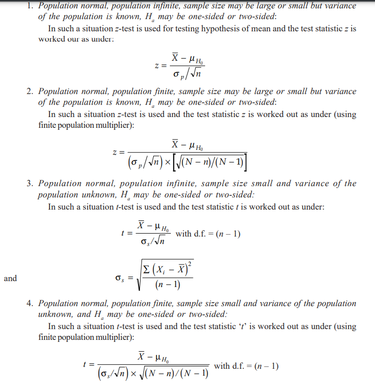

<h1>Data Science ESE</h1>

> Author : Aaron Augustine

> Star the gist so that I can get a consensus on how many people are using this resource
> 
[Github Repo Link for all ESE Notes](https://github.com/ToothlessRider/Sem_3_Notes.git)

## Table of Contents
- [Table of Contents](#table-of-contents)
- [Syallbus](#syallbus)
- [Previous Year Questions](#previous-year-questions)
- [Important Topics](#important-topics)
  - [Sampling Based Questions](#sampling-based-questions)
- [Important Sampling Distributions](#important-sampling-distributions)
  - [Sampling Error](#sampling-error)
- [Test of Significance](#test-of-significance)
  - [Z-Test](#z-test)
  - [T-test](#t-test)
  - [Hypothesis](#hypothesis)
    - [Null and Alternative Hypothesis](#null-and-alternative-hypothesis)

## Syallbus
- PPT 1 - 6 : 
- PP16 : Population and Samples

---

## Previous Year Questions

Q1. a. **The mean of a manufacturing process is known to be 50 with a standard deviation of 2.5. The manufacturing manager may welcome any change is mean value towards higher side but would like to safeguard against decreasing values of mean. He takes a sample of 12 items that gives a mean value of 48.5. What inference should the manager take for the manufacturing process on the basis of sample results? Use 5% level of significance for the purpose.**

Ans. 
This is a one-tailed hypothesis test (left-tailed) for the population mean since the manufacturing manager is concerned about a **decrease** in the mean value. Here's how the analysis proceeds:

---

**Step 1: Formulate Hypotheses**
- Null Hypothesis ($H_0$ ): The population mean is $\mu_0 = 50$. (No decrease in mean)
- Alternative Hypothesis ( $H_1$ ): The population mean is $\mu < 50$ . (Mean has decreased)

---

**Step 2: Test Statistic**
We use the $z$-test since the population standard deviation is known.

The $z$-test statistic is given by:
$z = \frac{\bar{x} - \mu_0}{\sigma / \sqrt{n}}$

Where:
- $\bar{x} = 48.5$ (Sample mean)
- $\mu_0 = 50$ (Population mean under $H_0$)
- $\sigma = 2.5$ (Standard deviation)
- $n = 12$ (Sample size)

Substitute the values:
$z = \frac{48.5 - 50}{2.5 / \sqrt{12}} = \frac{-1.5}{0.7217} \approx -2.08$

---

**Step 3: Critical Value and Significance Level**
For a one-tailed test at $\alpha = 0.05$, the critical value of $z$ is:
$z_{\text{critical}} = -1.645 \quad (\text{from the standard normal table}).$

---

**Step 4: Decision Rule**
- If $z \leq z_{\text{critical}}$, reject $H_0$ (mean has decreased).
- Otherwise, fail to reject $H_0$.

---

**Step 5: Conclusion**
The calculated $z$-value is $-2.08$, which is **less than** the critical value $-1.645$. Thus, we reject the null hypothesis.

---

**Inference**
The sample provides sufficient evidence to conclude that the mean of the manufacturing process has **decreased below 50**. The manager should investigate and take corrective action to safeguard the process.

--- 

Q1. b. **Sanju Hotel near the bus stop at Mumbai has been having average sales of 500 coffee cups per day. Because of the development of railway station nearby, it expects to increase its sales. During the first 12 days after the start of the railway station, the daily sales were as under: 550, 570, 490, 615, 505, 580, 570, 460, 600, 580, 530, 526 On the basis of this sample information, can one conclude that Sanju Hotel's sales have increased? Use 5% level of significance.**

Ans .
Page 214 pdf /203 book 

---

Q1. c. **A non-normal distribution representing the number of trips performed by lorries per week in a coal field has a mean of 100 trips and variance of 121 trips. A random sample of 36 lorries is taken from the non-normal population. What is the probability that the sample mean is**
i) greater than 105 trips
ii) less than 102 trips and
iii) between 101 trips and 103 trips?
(Use central limit theorem)

Ans. 

**Central Limit Theorem (CLT)**

**Given Data**
1. Population mean ($\mu$) = 100 trips  
2. Population variance ($\sigma^2$) = 121 trips  
3. Standard deviation ($\sigma$) = $\sqrt{121} = 11$ trips  
4. Sample size ($n$) = 36  
5. Standard error of the mean ($\sigma_{\bar{X}}$) = $\frac{\sigma}{\sqrt{n}} = \frac{11}{\sqrt{36}} = \frac{11}{6} \approx 1.833$.

The sampling distribution of the sample mean follows a normal distribution, even though the population is non-normal, according to the CLT. Hence:
$\bar{X} \sim N(\mu, \sigma_{\bar{X}}^2) = N(100, 1.833^2).$

---

**Step 1: Convert to the Standard Normal Distribution**

We use the $z$-score formula for the sample mean:
$z = \frac{\bar{X} - \mu}{\sigma_{\bar{X}}}$

**(i) Probability that the sample mean is greater than 105 trips**

Calculate the $z$-score:
$z = \frac{105 - 100}{1.833} \approx \frac{5}{1.833} \approx 2.73$

Using the standard normal table or a calculator, the cumulative probability up to $z = 2.73$ is:
$P(Z \leq 2.73) \approx 0.9968$

The probability that the sample mean is greater than 105 is:
$P(\bar{X} > 105) = 1 - P(Z \leq 2.73) = 1 - 0.9968 = 0.0032$

**(ii) Probability that the sample mean is less than 102 trips**

Calculate the $z$-score:
$z = \frac{102 - 100}{1.833} \approx \frac{2}{1.833} \approx 1.09$

From the standard normal table, the cumulative probability up to $z = 1.09$ is:
$P(Z \leq 1.09) \approx 0.8621$

Thus, the probability that the sample mean is less than 102 is:
$P(\bar{X} < 102) \approx 0.8621$

**(iii) Probability that the sample mean is between 101 trips and 103 trips**

For $\bar{X} = 101$:
$z = \frac{101 - 100}{1.833} \approx \frac{1}{1.833} \approx 0.55$

For $\bar{X} = 103$:
$z = \frac{103 - 100}{1.833} \approx \frac{3}{1.833} \approx 1.64$

From the standard normal table:
- $P(Z \leq 0.55) \approx 0.7088$
- $P(Z \leq 1.64) \approx 0.9495$

The probability that the sample mean is between 101 and 103 trips is:
$P(101 \leq \bar{X} \leq 103) = P(Z \leq 1.64) - P(Z \leq 0.55)$
$P(101 \leq \bar{X} \leq 103) = 0.9495 - 0.7088 = 0.2407$

**Final Answers**
1. $P(\bar{X} > 105) \approx 0.0032$  
2. $P(\bar{X} < 102) \approx 0.8621$  
3. $P(101 \leq \bar{X} \leq 103) \approx 0.2407$  

--- 

Q2. a. **The analyst of the study divided the entire population of the schools into schools in rural locations, semi-urban locations and urban locations. The analyst prefers to use proportionate stratified sampling in which the categories of location represent strata. The total number of schools in the state is 8000 which is divided into three strata of rural, semi-urban and urban locations. The number of schools in the rural, semi-urban and urban locations are 4000, 2400 and 1600, respectively. If the proportionate stratified sampling is to be used wih the sampling size of 30, determine the number of sampling units for each category of locations.**

Ans. 
To determine the number of sampling units for each category using **proportionate stratified sampling**, we allocate the sample size proportionally to the size of each stratum in the population.

---

**Step-by-Step Solution**
1. **Given Data:**
   - Total number of schools in the state = $8000$
   - Number of schools in:
     - Rural locations = $4000$
     - Semi-urban locations = $2400$
     - Urban locations = $1600$
   - Total sample size = $30$

2. **Proportionate Allocation Formula:**
   For each stratum, the number of sampling units is calculated as:
   $n_i = \frac{N_i}{N} \cdot n$
   where:
   - $N_i$ = Number of schools in the $i$-th stratum
   - $N$ = Total number of schools in the population
   - $n$ = Total sample size
   - $n_i$ = Number of sampling units for the $i$-th stratum

**Calculations:**

(i) Rural locations:
$n_{\text{rural}} = \frac{4000}{8000} \cdot 30 = 0.5 \cdot 30 = 15$

(ii) Semi-urban locations:
$n_{\text{semi-urban}} = \frac{2400}{8000} \cdot 30 = 0.3 \cdot 30 = 9$

(iii) Urban locations:
$n_{\text{urban}} = \frac{1600}{8000} \cdot 30 = 0.2 \cdot 30 = 6$

**Final Allocation:**
- **Rural locations:** 15 sampling units  
- **Semi-urban locations:** 9 sampling units  
- **Urban locations:** 6 sampling units  

This proportional allocation ensures that the sample is representative of the distribution of schools across the three location categories.

---

Q2. b. **A sample of 11 circuits from a large normal population has a mean resistance of 2.20 ohms. Population standard deviation is not known. Sample standard deviation is 0.35 ohms. Determine a 95% confidence interval for the true mean resiatance of the population.**

Ans. 
To calculate the **95% confidence interval** for the true mean resistance, we use the **t-distribution** since the population standard deviation is unknown and the sample size is small ($n = 11$ ).

**Step-by-Step Solution**

**1. Given Data:**
- Sample size ( $n$ ) = 11  
- Sample mean ( $\bar{x}$ ) = 2.20 ohms  
- Sample standard deviation ( $s$ ) = 0.35 ohms  
- Confidence level = 95% ($ \alpha = 0.05$ )  
- Degrees of freedom ( $\text{df}$ ) = $n - 1 = 11 - 1 = 10$   

**2. Formula for Confidence Interval:**
The confidence interval is given by:
$\text{CI} = \bar{x} \pm t_{\alpha/2, \, \text{df}} \cdot \frac{s}{\sqrt{n}}$
where:
- $t_{\alpha/2, \, \text{df}}$  is the critical value of $t$  at $\alpha/2 = 0.025$  and $\text{df} = 10$ .
- $\frac{s}{\sqrt{n}}$  is the standard error of the mean.

**3. Calculate the Standard Error of the Mean:**
$\text{SE} = \frac{s}{\sqrt{n}} = \frac{0.35}{\sqrt{11}} \approx \frac{0.35}{3.3166} \approx 0.1055$

**4. Determine the Critical $t$ -Value:**
From the **t-distribution table** or a calculator, for $\alpha/2 = 0.025$  and $\text{df} = 10$ :
$t_{\alpha/2, \, 10} \approx 2.228$

**5. Calculate the Confidence Interval:**
$\text{CI} = \bar{x} \pm t_{\alpha/2, \, \text{df}} \cdot \text{SE}$
$\text{CI} = 2.20 \pm 2.228 \cdot 0.1055$
$\text{CI} = 2.20 \pm 0.2351$

**6. Final Confidence Interval:**
$\text{CI} = (2.20 - 0.2351, 2.20 + 0.2351)$
$\text{CI} = (1.9649, 2.4351)$

**Final Answer:**
The **95% confidence interval** for the true mean resistance is:
$(1.96 \, \text{ohms}, \, 2.44 \, \text{ohms})$

This means we are 95% confident that the true mean resistance of the population lies within this interval.

---

Q2. c. **What are the different five questions related to the model (5) CO2 evaluation.**

Ans.

---

Q2. d. **Explain convenience samples and voluntary samples with examples. (At least 2 examples for each).** 

Ans. 
**Convenience Samples** and **Voluntary Samples** are two types of non-probability sampling methods often used for practical or specific research purposes. Here’s a detailed explanation with examples for each:

**1. Convenience Samples**
A **convenience sample** is collected from a population subset that is readily available or easy to access. It prioritizes practicality over randomness, which can introduce bias and limit the generalizability of findings.
**Key Features:**
- It involves participants who are easy to reach.
- Does not ensure representation of the entire population.
- Often used in exploratory research or when time/resources are limited.

**Examples:**
1. **University Survey:**
   A researcher wants to study the sleep patterns of college students. Instead of surveying all universities, they collect data only from students on their campus because they are easily accessible.
   
2. **Mall Intercept Interviews:**
   A marketing agency conducts interviews with customers at a shopping mall to understand consumer preferences. They only interview people who happen to be shopping at that time and location.

---

**2. Voluntary Samples**
A **voluntary sample** consists of individuals who self-select to participate in a study, often in response to an open invitation. This method risks attracting only those with strong opinions or interests in the topic, leading to biased results.

**Key Features:**
- Participants choose to be part of the study.
- Often results in overrepresentation of certain viewpoints.
- Commonly used in opinion polls or online surveys.

**Examples:**
1. **Online Product Feedback:**
   A company sends an email to all its customers asking them to rate a new product. Only customers who feel strongly about the product (positive or negative) are likely to respond.

2. **TV Show Poll:**
   A news channel asks viewers to vote online or via SMS on whether they agree with a particular policy. The results may not reflect the views of the general population, as only motivated viewers participate.

**Comparison:**
| Feature               | Convenience Sample                  | Voluntary Sample                     |
|-----------------------|-------------------------------------|--------------------------------------|
| **Selection Process** | Based on ease of access.           | Based on participants' self-selection. |
| **Bias**              | Skews towards easily accessible groups. | Skews towards those with strong opinions. |
| **Examples**          | Campus surveys, mall intercepts.   | Online polls, customer feedback surveys. |

---

Q3. a. **The education department of a state wants to study the standard of education in schools. The analyst of the study divided the entire population of the schools into schools in rural locations, semi-urban locations and urban locations. He found more variation between schools in rural locations because of varying infrastructure than the variation between schools in semi-urban locations. Same is the case between semi-urban locations an urban locations. The analyst prefers to use disproportionate stratified sampling in which the categories of location represent strata. The total number of schools in the state is 1200. The number of schools in the rural, semi-urban and urban locations are 500, 400 and 300, respectively. The variance of educational standard of the schools in these locations are 49, 16 and 4, respectively. If the disproportionate stratified sampling is to be used wih the sampling size of 90, determine the number of sampling units for each category of locations.**

Ans. 
In **disproportionate stratified sampling**, the sampling units are allocated based on both the size of each stratum and its variance. The allocation is typically done using **Neyman allocation**, which considers the variability (standard deviation) within each stratum to optimize sampling.

 **Step-by-Step Solution**

**1. Given Data:**
- Total number of schools:  $N = 1200$ 
- Strata details:
  - Rural schools ( $N_{\text{rural}}$ ):  $500$ , Variance ( $S_{\text{rural}}^2$ ):  $49$ 
  - Semi-urban schools ( $N_{\text{semi-urban}}$ ):  $400$ , Variance ( $S_{\text{semi-urban}}^2$ ):  $16$ 
  - Urban schools ( $N_{\text{urban}}$ ):  $300$ , Variance ( $S_{\text{urban}}^2$ ):  $4$ 
- Total sample size:  $n = 90$ 

**2. Neyman Allocation Formula:**
The sample size for each stratum is proportional to the product of the stratum size and the standard deviation:
$n_i = n \cdot \frac{N_i \cdot S_i}{\sum_{j=1}^k N_j \cdot S_j}$ 
where:
-  $n_i$ : Sample size for the  $i$ -th stratum
-  $N_i$ : Number of schools in the  $i$ -th stratum
-  $S_i$ : Standard deviation of the  $i$ -th stratum ( $S_i = \sqrt{S_i^2}$ )
-  $k$ : Total number of strata
-  $n$ : Total sample size

**3. Calculate the Standard Deviations:**
$S_{\text{rural}} = \sqrt{49} = 7, \quad S_{\text{semi-urban}} = \sqrt{16} = 4, \quad S_{\text{urban}} = \sqrt{4} = 2$ 

**4. Calculate the Weights for Each Stratum:**
$W_{\text{rural}} = N_{\text{rural}} \cdot S_{\text{rural}} = 500 \cdot 7 = 3500$ 
$W_{\text{semi-urban}} = N_{\text{semi-urban}} \cdot S_{\text{semi-urban}} = 400 \cdot 4 = 1600$ 
$W_{\text{urban}} = N_{\text{urban}} \cdot S_{\text{urban}} = 300 \cdot 2 = 600$ 
$\text{Total weight: } W_{\text{total}} = W_{\text{rural}} + W_{\text{semi-urban}} + W_{\text{urban}} = 3500 + 1600 + 600 = 5700$ 

 **5. Allocate Sample Sizes:**
Using the Neyman allocation formula:
$n_{\text{rural}} = n \cdot \frac{W_{\text{rural}}}{W_{\text{total}}} = 90 \cdot \frac{3500}{5700} \approx 55.26 \approx 55$ 
$n_{\text{semi-urban}} = n \cdot \frac{W_{\text{semi-urban}}}{W_{\text{total}}} = 90 \cdot \frac{1600}{5700} \approx 25.26 \approx 25$ 
$n_{\text{urban}} = n \cdot \frac{W_{\text{urban}}}{W_{\text{total}}} = 90 \cdot \frac{600}{5700} \approx 9.47 \approx 10$ 

**Final Allocation:**
- **Rural locations:** 55 sampling units  
- **Semi-urban locations:** 25 sampling units  
- **Urban locations:** 10 sampling units  

This allocation accounts for the higher variability in rural schools and ensures a representative sample distribution.

---

Q3. b. **A random sample of 100 people shows that 25 have opened IRA (individual retirement arrangement) this year. Construct a 95% confidence interval for true proportion of people who have opened IRA. (Use population proportion).**

Ans. 
To construct the **95% confidence interval** for the true proportion of people who have opened an IRA, we use the formula for the confidence interval of a population proportion:

**Step 1: Given Data**
- Sample size ($n$) = 100  
- Number of people who opened an IRA ($x$) = 25  
- Sample proportion ($\hat{p}$) = $\frac{x}{n} = \frac{25}{100} = 0.25$  
- Confidence level = 95%  
- $z_{crit}$ for 95% confidence = 1.96 (from standard normal distribution).

**Step 2: Formula for Confidence Interval**
$\text{CI} = \hat{p} \pm z_{crit} \cdot \sqrt{\frac{\hat{p}(1 - \hat{p})}{n}}$ 

Where:
- $\hat{p}$ = sample proportion  
- $1 - \hat{p}$ = complement of the proportion  
- $n$ = sample size  
- $z_{crit}$ = critical value for 95% confidence.

**Step 3: Calculate the Margin of Error (MOE)**
$\text{MOE} = z_{crit} \cdot \sqrt{\frac{\hat{p}(1 - \hat{p})}{n}}$ 

Substitute the values:
$\text{MOE} = 1.96 \cdot \sqrt{\frac{0.25(1 - 0.25)}{100}}$ 

Simplify:
$\text{MOE} = 1.96 \cdot \sqrt{\frac{0.25 \cdot 0.75}{100}} = 1.96 \cdot \sqrt{\frac{0.1875}{100}} = 1.96 \cdot \sqrt{0.001875}$ 

$\text{MOE} = 1.96 \cdot 0.0433 \approx 0.0848$ 

 **Step 4: Calculate the Confidence Interval**
$\text{CI} = \hat{p} \pm \text{MOE}$ 

Substitute the values:
$\text{CI} = 0.25 \pm 0.0848$ 

$\text{CI} = [0.25 - 0.0848, 0.25 + 0.0848] = [0.1652, 0.3348]$ 

**Conclusion**
The 95% confidence interval for the true proportion of people who have opened an IRA this year is **[0.1652, 0.3348]**. This means the true proportion is likely between **16.52%** and **33.48%**.

---

Q3. c. **Suppose a certain hotel management is interested in determining the percentage of hotel's guests who stay for more than 3 days. The reservation manager wants to be 95% confident that the percentage has been estimated to be within +/- 3% of the true value. What is the most conservative sample size needed for this problem?**

Ans. 
To determine the most conservative sample size needed, we use the formula for the sample size of proportions:

$n = \frac{Z^2 \cdot p \cdot (1 - p)}{E^2}$ 

**Where**:  
- $Z$: Z-value corresponding to the desired confidence level (for 95%, $Z = 1.96$)  
- $p$: Proportion of the population with the characteristic of interest (for conservative estimate, $p = 0.5$)  
- $E$: Margin of error ($E = 0.03$ or 3%)

**Step 1**: Plug in the values
$n = \frac{(1.96)^2 \cdot 0.5 \cdot (1 - 0.5)}{(0.03)^2}$ 

**Step 2**: Simplify the equation
- $1.96^2 = 3.8416$
- $0.5 \cdot (1 - 0.5) = 0.25$
- $0.03^2 = 0.0009$

$n = \frac{3.8416 \cdot 0.25}{0.0009}$ 

$n = \frac{0.9604}{0.0009} \approx 1067.11$ 

**Step 3**: Round up to the nearest whole number
Since the sample size must be an integer, and we round up to ensure the margin of error requirement is met, the **sample size** is:

$n = 1068$ 

**Final Answer**:
The most conservative sample size needed is **1068**.

---

Q3. d. **Which are five different questions for data understanding? Discuss in detail.**

Ans. 
When working with data, it's crucial to gain a deep understanding of it before moving forward with analysis or modeling. Here are five key questions for **data understanding** that help you uncover important aspects of your data:

**1. What is the nature of the data?**
Understanding the type of data you are working with is the first step. Data can generally be classified as:
- **Categorical** (qualitative): Data that represents categories (e.g., gender, color, country).
- **Numerical** (quantitative): Data that represents numbers (e.g., height, weight, age).
  - **Discrete**: Countable values (e.g., number of children).
  - **Continuous**: Measurable values (e.g., temperature, time).

**Example**:
For a dataset containing student information, "gender" would be categorical, while "age" would be numerical.

**2. What are the missing values?**
Missing values are common in real-world data. Identifying missing values helps in determining how to handle them, whether by imputation, removal, or other techniques. This question also helps assess the **completeness** of the data.

**Example**:
If you're analyzing a dataset of patient records, missing values might represent uncollected medical data (e.g., missing age or diagnosis). 

- **How to address**: Use techniques like mean imputation, regression imputation, or removing rows with missing data.

**3. Are there any outliers?**
Outliers are data points that differ significantly from the rest of the data. Identifying outliers is important because they can skew results, distort statistical analyses, and influence model predictions.

**Example**:
In a dataset of employee salaries, a salary of $5,000,000 might be an outlier if most employees earn between $40,000 and $100,000. You can detect outliers using statistical methods like the **IQR (Interquartile Range)** or visualizations like box plots.

**4. What is the distribution of the data?**
Understanding the distribution of your data helps to determine if your data is symmetric, skewed, normal, or if it contains multiple modes. This is crucial for choosing appropriate statistical methods and techniques.

**Example**:
In a dataset of house prices, you may find that the data is **right-skewed**, meaning most houses are inexpensive, but a few extremely expensive houses drive the tail of the distribution.

- **How to analyze**: Use histograms, density plots, or summary statistics (mean, median, skewness).

**5. What are the relationships between variables?**
Understanding the relationships between different variables helps you identify patterns, correlations, or dependencies that may exist. This is crucial when building predictive models or drawing conclusions.

**Example**:
In a dataset of car sales, you may explore the relationship between **price** and **engine size**, or **price** and **car type**. These relationships can be examined using correlation coefficients, scatter plots, or cross-tabulations.

- **How to analyze**: Use statistical tests (e.g., Pearson correlation, Chi-square test) or visualizations (e.g., scatter plots, pair plots).

**Conclusion:**
These five questions provide a structured approach to understanding the data:
1. What is the nature of the data? (Categorical vs. Numerical)
2. What are the missing values? (Identifying incompleteness)
3. Are there any outliers? (Detecting extreme values)
4. What is the distribution of the data? (Understanding its shape)
5. What are the relationships between variables? (Exploring inter-variable dependencies)

--- 

Q4. a. **Two researchers adopted different sampling techniques while investigating the same group of customers to find the number of customers falling in different buying-intelligence levels. Test if "Researcher" is independent of "No. of customers in each level" using chi-square distribution. (use alpha=0.05)**

Ans. 
This problem requires conducting a **Chi-Square Test for Independence** to determine if there is a significant relationship between "Researcher" and the "Number of customers in each level." Let's solve it step by step.

**Step 1: Hypotheses**
- **Null Hypothesis ( $H_0$ )**: The "Researcher" and the "Number of customers in each level" are independent.
- **Alternative Hypothesis ($H_a$ )**: The "Researcher" and the "Number of customers in each level" are not independent.

**Step 2: Observed Frequencies**
From the table:
$O = 
\begin{bmatrix}
86 & 60 & 44 & 10 \\
40 & 33 & 25 & 2 
\end{bmatrix}$ 
- Rows represent **Class (Researcher 1 and 2)**.
- Columns represent **Buying-Intelligence Levels (Below average, Average, Above average, Genius).**

**Step 3: Calculate Expected Frequencies**
The expected frequencies ($E$ ) are calculated using the formula:
$E_{ij} = \frac{\text{Row Total}_i \times \text{Column Total}_j}{\text{Grand Total}}$ 
**Step 3.1: Calculate Totals**
- **Row Totals:**
  - Row 1 (Class 1): $86 + 60 + 44 + 10 = 200$ 
  - Row 2 (Class 2): $40 + 33 + 25 + 2 = 100$ 
- **Column Totals:**
  - Column 1 (Below average): $86 + 40 = 126$ 
  - Column 2 (Average): $60 + 33 = 93$ 
  - Column 3 (Above average): $44 + 25 = 69$ 
  - Column 4 (Genius): $10 + 2 = 12$ 
- **Grand Total:** $200 + 100 = 300$ 

 **Step 3.2: Compute Expected Frequencies**
Using the formula $E_{ij} = \frac{\text{Row Total}_i \times \text{Column Total}_j}{\text{Grand Total}}$ , compute $E$ :

$E = 
\begin{bmatrix}
\frac{200 \times 126}{300} & \frac{200 \times 93}{300} & \frac{200 \times 69}{300} & \frac{200 \times 12}{300} \\
\frac{100 \times 126}{300} & \frac{100 \times 93}{300} & \frac{100 \times 69}{300} & \frac{100 \times 12}{300}
\end{bmatrix}$ 
- Row 1:
  - $E_{11} = \frac{200 \times 126}{300} = 84$ 
  - $E_{12} = \frac{200 \times 93}{300} = 62$ 
  - $E_{13} = \frac{200 \times 69}{300} = 46$ 
  - $E_{14} = \frac{200 \times 12}{300} = 8$ 

- Row 2:
  - $E_{21} = \frac{100 \times 126}{300} = 42$ 
  - $E_{22} = \frac{100 \times 93}{300} = 31$ 
  - $E_{23} = \frac{100 \times 69}{300} = 23$ 
  - $E_{24} = \frac{100 \times 12}{300} = 4$ 

Thus:
$E = 
\begin{bmatrix}
84 & 62 & 46 & 8 \\
42 & 31 & 23 & 4
\end{bmatrix}$ 

**Step 4: Compute Chi-Square Statistic**
The Chi-Square statistic is calculated using:
$\chi^2 = \sum \frac{(O_{ij} - E_{ij})^2}{E_{ij}}$ 

**Step 4.1: Calculate $(O - E)^2 / E$  for Each Cell**
- Row 1:
  - $(86 - 84)^2 / 84 = \frac{4}{84} = 0.048$ 
  - $(60 - 62)^2 / 62 = \frac{4}{62} = 0.065$ 
  - $(44 - 46)^2 / 46 = \frac{4}{46} = 0.087$ 
  - $(10 - 8)^2 / 8 = \frac{4}{8} = 0.5$ 

- Row 2:
  - $(40 - 42)^2 / 42 = \frac{4}{42} = 0.095$ 
  - $(33 - 31)^2 / 31 = \frac{4}{31} = 0.129$ 
  - $(25 - 23)^2 / 23 = \frac{4}{23} = 0.174$ 
  - $(2 - 4)^2 / 4 = \frac{4}{4} = 1.0$ 

**Step 4.2: Sum All Values**
$\chi^2 = 0.048 + 0.065 + 0.087 + 0.5 + 0.095 + 0.129 + 0.174 + 1.0 = 2.098$ 

**Step 5: Degrees of Freedom**
The degrees of freedom ($df$ ) are:
$df = (\text{Number of rows} - 1) \times (\text{Number of columns} - 1) = (2 - 1) \times (4 - 1) = 3$ 

**Step 6: Critical Value**
For  $\alpha = 0.05$  and  $df = 3$ , the critical value from the Chi-Square table is:
$\chi^2_{\text{critical}} = 7.815$ 

**Step 7: Conclusion**
-  $\chi^2_{\text{calculated}} = 2.098$ 
-  $\chi^2_{\text{critical}} = 7.815$ 

Since  $\chi^2_{\text{calculated}} < \chi^2_{\text{critical}}$ , we **fail to reject the null hypothesis**.

**Final Answer:**
The data suggests that the "Researcher" and the "Number of customers in each level" are **independent** at the 5% significance level.

---

Q4. b. **Out of hundreds of people. You randomly chose 46 men with a mean of 86 inches (height) with a standard deviation of 6.2 inches. Determine that the selected men are tall enough. Take the confidence level as 95%.**

Ans. 
To determine whether the selected men are tall enough, we calculate the **95% confidence interval** (CI) for the mean height of the population based on the sample. The confidence interval helps us infer whether the population mean lies within the desired range.

**Step 1: Given Data**
- Sample size ($n$ ) = 46  
- Sample mean ($\bar{x}$ ) = 86 inches  
- Sample standard deviation ($s$ ) = 6.2 inches  
- Confidence level = 95%  
- Critical value for 95% CI ($t_{crit}$ ) = Based on the $t$ -distribution with $n-1 = 45$  degrees of freedom.

**Step 2: Formula for Confidence Interval**
The confidence interval is calculated as:

$\text{CI} = \bar{x} \pm t_{crit} \cdot \frac{s}{\sqrt{n}}$

Where:
- $\bar{x}$  = sample mean  
- $t_{crit}$  = critical $t$ -value for 95% confidence  
- $s$  = sample standard deviation  
- $n$  = sample size  

**Step 3: Determine $t_{crit}$**
Using a $t$ -distribution table or calculator for 95% confidence and $df = 45$ , $t_{crit} \approx 2.014$ .

**Step 4: Calculate the Margin of Error (MOE)**
$\text{MOE} = t_{crit} \cdot \frac{s}{\sqrt{n}}$

Substitute the values:
$\text{MOE} = 2.014 \cdot \frac{6.2}{\sqrt{46}}$

$\sqrt{46} \approx 6.782$ , so:
$\text{MOE} = 2.014 \cdot \frac{6.2}{6.782} \approx 2.014 \cdot 0.914 \approx 1.841$

**Step 5: Calculate the Confidence Interval**
$\text{CI} = \bar{x} \pm \text{MOE}$

Substitute the values:
$\text{CI} = 86 \pm 1.841$

$\text{CI} = [84.159, 87.841]$

**Conclusion**
The 95% confidence interval for the mean height of the population is **[84.16 inches, 87.84 inches]**. If being "tall enough" requires the mean height to be above a certain threshold (e.g., 85 inches), the interval suggests the group is likely tall enough because most of the range is above 85 inches.

--- 

Q4. c. **Why is data science popular today? Explain in detail.**

Ans. 
1. **Data Explosion**  
   - Massive growth in data generation from social media, IoT, e-commerce, etc.  
   - Need to process and analyze large, complex datasets.  

2. **Business Value**  
   - Insights from data drive better decision-making.  
   - Enhances customer experiences, optimizes operations, and increases profitability.  

3. **Advancements in Technology**  
   - Affordable storage and computational power through cloud computing.  
   - Tools like Python, R, and libraries like TensorFlow and PyTorch simplify analysis.  

4. **Artificial Intelligence (AI) and Machine Learning (ML)**  
   - Data science enables AI/ML applications like predictive modeling, recommendation systems, and automation.  

5. **Diverse Applications**  
   - Used in industries like healthcare, finance, retail, education, and transportation.  
   - Examples: Disease diagnosis, fraud detection, personalized marketing, and autonomous vehicles.  

6. **Job Opportunities**  
   - High demand for skilled data scientists due to the rising importance of data-driven strategies.  
   - Offers lucrative career paths.  

7. **Global Connectivity**  
   - Digital transformation and globalization require efficient data use for competitive advantage.  

8. **Visualization and Accessibility**  
   - Data science makes complex data accessible and understandable through visualizations.  
   - Facilitates communication of insights to non-technical stakeholders.  

9. **Real-Time Decision-Making**  
   - Enables businesses to act on real-time data, such as dynamic pricing and traffic management.  

10. **Government and Research Usage**  
   - Governments use data science for policy-making and public services.  
   - Research in sciences and humanities benefits from large-scale data analysis.  

---

Q4. d. **Explain Central Limit Theorem and alternative version of Central Limit Theorem in detail.**

Ans. 
**Central Limit Theorem (CLT)**

The **Central Limit Theorem (CLT)** states that the distribution of the sample mean will approach a normal distribution as the sample size increases, regardless of the population's distribution. The sample means will have:
- Mean = Population mean ($\mu$).
- Standard deviation (Standard Error) = $\frac{\sigma}{\sqrt{n}}$, where $\sigma$ is the population standard deviation, and $n$ is the sample size.

 **Key Conditions**:
1. Sample size should be sufficiently large ($n \geq 30$).
2. The samples should be independent and randomly selected.

**Alternative CLT (Sum of Random Variables)**

This version focuses on the sum of random variables. If $X_1, X_2, ..., X_n$ are independent random variables:
- The sum $S_n = \sum_{i=1}^n X_i$ will follow a normal distribution with:
  $S_n \sim N(n\mu, \sqrt{n}\sigma)$
  where $\mu$ is the mean and $\sigma$ is the standard deviation of the individual random variables.

**Example**:
- For a population with a mean of $70$ and standard deviation of $15$, a sample of $n=40$ will have a sample mean distribution of approximately $N(70, 2.37)$, where $2.37$ is the standard error.

**Applications**:
1. Hypothesis testing and confidence intervals.
2. Approximation of population parameters when the population is not normally distributed.

--- 

Q5. a. **Explain point and interval estimators in detail with proper example.**

Ans. 
**Point Estimators**
- A **point estimator** is a single value used to estimate an unknown population parameter (e.g., sample mean $\bar{x}$ for population mean $μ$).
- **Example**: If the sample mean height of 50 students is 87 inches, then 87 is the point estimator for the population mean height.
- **Characteristics**: 
  - **Unbiased**: Expected value equals the true parameter.
  - **Consistent**: Closer to true value as sample size increases.
  - **Efficient**: Smallest variance among estimators.

**Interval Estimators**
- An **interval estimator** provides a range of values for a parameter, with a confidence level indicating how likely the range includes the true parameter.
- **Example**: For a sample mean of 87, a 95% confidence interval for the population mean might be $(84.23, 89.77)$.
- **Formula for Mean Confidence Interval**: 
  $\left( \bar{x} - Z_{\alpha/2} \cdot \frac{\sigma}{\sqrt{n}}, \ \bar{x} + Z_{\alpha/2} \cdot \frac{\sigma}{\sqrt{n}} \right)$
  

**Comparison**
- **Point Estimator**: Provides a single estimate (e.g., $\bar{x} = 87$), no indication of uncertainty.
- **Interval Estimator**: Provides a range (e.g., $[84.23, 89.77]$) with uncertainty, better for expressing confidence in the estimate.

**Usage**
- **Point Estimators** are useful for quick estimates.
- **Interval Estimators** are preferred when the uncertainty of the estimate needs to be conveyed.

---

Q5. b. **You are teaching an online course and based on your internal surveys claim that 60% of your students like your course. A course review committee is skeptical about your claims and wants to test them. How would they go about this. Out of 100 students 62 students said yes. The confidence level is 90%**

Ans. 

---

Q5. c. **Explain statistical modelling of data in detail with an appropriate example**

Ans. 

--- 

Q5. d. **What are the different five questions for data preparation? Explain in detail with proper example.**

Ans. 
Data preparation is a critical step in any data analysis or machine learning pipeline. It involves cleaning, transforming, and organizing raw data into a format that can be used for analysis or modeling. Below are five important questions for data preparation, explained in detail with examples:

---

**1. What data do we need?**
This question identifies the specific data required to address the problem or answer the research question. It ensures that you are working with relevant data.

**Example:**
- **Scenario**: You are predicting housing prices.
- **Required Data**: Data about house features (e.g., size, number of bedrooms, location, etc.), historical sales prices, and market conditions.
- **Action**: Collect data from real estate websites, government records, or APIs.

If irrelevant data is included, it may introduce noise, while missing key data can lead to inaccurate results.

---

**2. Is the data clean and accurate?**
This step checks for data quality issues such as missing values, duplicates, outliers, and inconsistencies.

**Example:**
- **Scenario**: A dataset includes customer transactions.
- **Issues**: Missing `transaction_amount`, duplicated rows, or unrealistic values (e.g., negative amounts).
- **Action**:
  - Handle missing values (e.g., by imputation or removal).
  - Remove duplicate records.
  - Detect and treat outliers using statistical methods like z-scores.

Poor data quality can lead to biased or misleading results.

---

**3. Is the data complete?**
This examines whether all required attributes and records are present. Missing data can occur due to errors in collection or data transfer.

**Example:**
- **Scenario**: A survey dataset is missing age for some respondents.
- **Action**:
  - Use techniques like mean/mode imputation, or estimate missing values using regression models.
  - Drop rows or columns if missing data is minimal.

If key data is incomplete, predictions or insights may be unreliable.

---

**4. Does the data need transformation or scaling?**
Raw data may not be in a usable format, requiring transformations like encoding, normalization, or feature engineering.

**Example:**
- **Scenario**: You are building a machine learning model using categorical data (e.g., `gender: male/female`).
- **Action**:
  - Convert categorical variables into numerical values using techniques like one-hot encoding.
  - Scale numerical features using standardization ($ z = \frac{x - \mu}{\sigma} $ ) or normalization ($ x' = \frac{x - \text{min}(x)}{\text{max}(x) - \text{min}(x)} $ ).

Transformation ensures all data is in a consistent and comparable format.

---

**5. Are there biases or patterns in the data?**
Data might contain inherent biases or patterns that could affect analysis or model performance.

**Example:**
- **Scenario**: A dataset of job applications may contain gender bias (e.g., more male applicants for technical roles).
- **Action**:
  - Analyze data distributions to identify biases.
  - Apply resampling techniques like oversampling or undersampling to balance classes.
  - Consider domain knowledge to identify and address biases.

Ignoring biases can lead to unfair or unethical decisions in predictive models.

---

**Summary Table of Questions and Examples**
| Question                           | Example Scenario                  | Key Actions                                       |
|------------------------------------|-----------------------------------|--------------------------------------------------|
| **What data do we need?**          | Predicting house prices           | Collect relevant features like size, location.   |
| **Is the data clean and accurate?**| Customer transactions             | Handle missing/duplicated/outlier records.       |
| **Is the data complete?**          | Survey data                       | Address missing age values using imputation.     |
| **Does the data need transformation or scaling?** | Categorical data for ML           | Apply one-hot encoding or normalization.         |
| **Are there biases or patterns?**  | Job application data              | Balance gender distribution in the dataset.      |

---

## Important Topics 

### Sampling Based Questions 
> What exactly is **Sampling** ?

Ans. Sampling may be defined as the selection of some part of a total on the basis of which a judgement or inference about the totality is made. 

> What are the advantages fo a sample study ? 

Ans. A sample study is very useful for the following reasons : 
1. Sampling can save time and money. A sample study is usually less expensive than a census study and produces results at a relatively faster speed.
2. Sampling may enable more accurate measurements
3. Sampling remains the only way when population contains infinitely many members
4. Sampling remains the only choice when a test involves the destruction of the item under
study

The sampling fundamentals are as follows : 
1. **Universe/Population** : 
   - Universe refers to the total items or units in a field of inquiry.
   - Population refers to the total items about which the information is desired.
   - They can be finite or infinite ( $N$ ) 
2. **Sampling Frame** : 
   - The group of cluster units which form the basis of sampling process.
3. **Sampling Design** : 
   - It is a definite plan to obtain a sample from teh sampling frame 
   - IIt is a technique used by the researcher to get sampling units from which we can draw an inference about the population
4. **Statistic(s) and parameter(s)** : 
   - **Statistic** is a characteristic of a sample, whereas **paramter** is a characteristic of the population.
   - Thus, when we work out certain measures such as mean, median, mode or the like ones from samples, then they are called **statistic(s)**.
   - If we get the same measures from the population we call them **Parameters**
5. **Sampling Error** :
   - $\text{Sampling error} = \text{Frame Error} + \text{Chance Error} + \text{Response Error}$ 
6. **Precision** : 
   - Precision is the range within which the population average (or other parameter) will lie in accordance with the reliability specified in the confidence level as a percentage of the estimate ± or as a numerical quantity.
7.  **Confidence level and significance level** : 
    - The confidence level or reliability is the expected percentage of times that the actual value will fall within the stated precision limits 

## Important Sampling Distributions 
1. **Sampling Distribution of Mean**
   - Sampling distribution of mean refers to the probability distribution of all the possible means of random samples of a given size that we take from a population
   - $N(\mu, \sigma_p)$
   - $\mu_x = \mu$
   -  $\sigma_p = \frac{\sigma}{\sqrt{n}}$ where $\mu$ is the mean of the population adn $\sigma_p$ is the standard deviation of the population
   -  

2. **Sampling Distribution of proportion**
3. **Student's 'T' Distribution**
4. **F distribution**
5. **Chi-square Distribution**

---

### Sampling Error 

Q1. **What is Data Science, Why multiple definition?**

Ans. Data science is a multidisciplinary field that uses techniques, algorithms, and tools to extract insights and knowledge from data, enabling data-driven decision-making and predictions.
Uses the following to do so : 
1. Data Analysis 
2. Statistics 
3. Machine learning 

---

## Test of Significance

---
To test the significance of the mean of a random sample
$t = \frac{\overline{X} - \mu}{\sigma_{\overline{X}}}$ where $\overline{X} = \text{Mean of the sample}$ ,   $\mu = \text{Mean of the universe/population}$ ,    $\sigma_{\overline{X}} = \text{Standard error of the mean worked out as under}$   $\sigma_{\overline{X}} = \frac{\sigma_s}{\sqrt{n}} = \sqrt{\frac{\sum (X_i - \overline{X})^2}{n-1}} \bigg/ \sqrt{n}$ and the degrees of freedom $= (n-1)$ .

*The $z$ -test may as well be applied in case of small sample provided we are given the variance of the population.*

---

### Z-Test 

[Reference](https://www.youtube.com/watch?v=bB-J6_wcGgE)

---

### T-test 

---

### Hypothesis 
Characteristics of hypothesis: Hypothesis must possess the following characteristics:
(i) Hypothesis should be clear and precise. If the hypothesis is not clear and precise, the
inferences drawn on its basis cannot be taken as reliable.
(ii) Hypothesis should be capable of being tested. In a swamp of untestable hypotheses, many
a time the research programmes have bogged down. Some prior study may be done by
researcher in order to make hypothesis a testable one. A hypothesis “is testable if other
deductions can be made from it which, in turn, can be confirmed or disproved by observation.”1
(iii) Hypothesis should state relationship between variables, if it happens to be a relational
hypothesis.
(iv) Hypothesis should be limited in scope and must be specific. A researcher must remember
that narrower hypotheses are generally more testable and he should develop such hypotheses.
(v) Hypothesis should be stated as far as possible in most simple terms so that the same is
easily understandable by all concerned. But one must remember that simplicity of hypothesis
has nothing to do with its significance.
(vi) Hypothesis should be consistent with most known facts i.e., it must be consistent with a
substantial body of established facts. In other words, it should be one which judges accept
as being the most likely.
(vii) Hypothesis should be amenable to testing within a reasonable time. One should not use
even an excellent hypothesis, if the same cannot be tested in reasonable time for one
cannot spend a life-time collecting data to test it.
(viii) Hypothesis must explain the facts that gave rise to the need for explanation. This means
that by using the hypothesis plus other known and accepted generalizations, one should be
able to deduce the original problem condition. Thus hypothesis must actually explain what
it claims to explain; it should have empirical reference.

#### Null and Alternative Hypothesis 
In the choice of null hypothesis, the following considerations are
usually kept in view:
(a) Alternative hypothesis is usually the one which one wishes to prove and the null hypothesis
is the one which one wishes to disprove. Thus, a null hypothesis represents the hypothesis
we are trying to reject, and alternative hypothesis represents all other possibilities.
(b) If the rejection of a certain hypothesis when it is actually true involves great risk, it is taken
as null hypothesis because then the probability of rejecting it when it is true is α (the level
of significance) which is chosen very small.
(c) Null hypothesis should always be specific hypothesis i.e., it should not state about or
approximately a certain value.