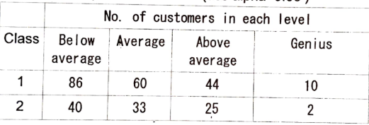
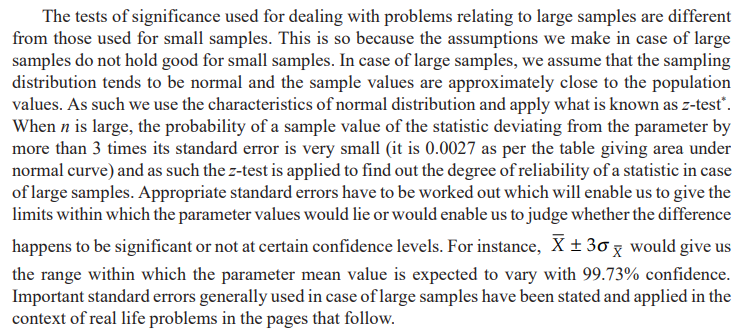

<h1>Data Science ESE</h1>

> Author : Aaron Augustine

> Star the gist so that I can get a consensus on how many people are using this resource
> 
[Github Repo Link for all ESE Notes](https://github.com/ToothlessRider/Sem_3_Notes.git)

## Table of Contents
- [Table of Contents](#table-of-contents)
- [Syallbus](#syallbus)
- [Previous Year Questions](#previous-year-questions)
- [Important Topics](#important-topics)
  - [Sampling Based Questions](#sampling-based-questions)
- [Important Sampling Distributions](#important-sampling-distributions)
  - [Sampling Error](#sampling-error)
- [Test of Significance](#test-of-significance)

## Syallbus
- PPT 1 - 6 : 
- PP16 : Population and Samples

---

## Previous Year Questions

Q1. a. **The mean of a manufacturing process is known to be 50 with a standard deviation of 2.5. The manufacturing manager may welcome any change is mean value towards higher side but would like to safeguard against decreasing values of mean. He takes a sample of 12 items that gives a mean value of 48.5. What inference should the manager take for the manufacturing process on the basis of sample results? Use 5% level of significance for the purpose.**

Ans. 
This is a one-tailed hypothesis test (left-tailed) for the population mean since the manufacturing manager is concerned about a **decrease** in the mean value. Here's how the analysis proceeds:

---

**Step 1: Formulate Hypotheses**
- Null Hypothesis ($H_0$ ): The population mean is $\mu_0 = 50$. (No decrease in mean)
- Alternative Hypothesis ( $H_1$ ): The population mean is $\mu < 50$ . (Mean has decreased)

---

**Step 2: Test Statistic**
We use the $z$-test since the population standard deviation is known.

The $z$-test statistic is given by:
$z = \frac{\bar{x} - \mu_0}{\sigma / \sqrt{n}}$

Where:
- $\bar{x} = 48.5$ (Sample mean)
- $\mu_0 = 50$ (Population mean under $H_0$)
- $\sigma = 2.5$ (Standard deviation)
- $n = 12$ (Sample size)

Substitute the values:
$z = \frac{48.5 - 50}{2.5 / \sqrt{12}} = \frac{-1.5}{0.7217} \approx -2.08$

---

**Step 3: Critical Value and Significance Level**
For a one-tailed test at $\alpha = 0.05$, the critical value of $z$ is:
$z_{\text{critical}} = -1.645 \quad (\text{from the standard normal table}).$

---

**Step 4: Decision Rule**
- If $z \leq z_{\text{critical}}$, reject $H_0$ (mean has decreased).
- Otherwise, fail to reject $H_0$.

---

**Step 5: Conclusion**
The calculated $z$-value is $-2.08$, which is **less than** the critical value $-1.645$. Thus, we reject the null hypothesis.

---

**Inference**
The sample provides sufficient evidence to conclude that the mean of the manufacturing process has **decreased below 50**. The manager should investigate and take corrective action to safeguard the process.

--- 

Q1. b. **Sanju Hotel near the bus stop at Mumbai has been having average sales of 500 coffee cups per day. Because of the development of railway station nearby, it expects to increase its sales. During the first 12 days after the start of the railway station, the daily sales were as under: 550, 570, 490, 615, 505, 580, 570, 460, 600, 580, 530, 526 On the basis of this sample information, can one conclude that Sanju Hotel's sales have increased? Use 5% level of significance.**

Ans .

---

Q1. c. **A non-normal distribution representing the number of trips performed by lorries per week in a coal field has a mean of 100 trips and variance of 121 trips. A random sample of 36 lorries is taken from the non-normal population. What is the probability that the sample mean is**
i) greater than 105 trips
ii) less than 102 trips and
iii) between 101 trips and 103 trips?
(Use central limit theorem)

Ans. 

--- 

Q2. a. **The analyst of the study divided the entire population of the schools into schools in rural locations, semi-urban locations and urban locations. The analyst prefers to use proportionate stratified sampling in which the categories of location represent strata. The total number of schools in the state is 8000 which is divided into three strata of rural, semi-urban and urban locations. The number of schools in the rural, semi-urban and urban locations are 4000, 2400 and 1600, respectively. If the proportionate stratified sampling is to be used wih the sampling size of 30, determine the number of sampling units for each category of locations.**

Ans. 

---

Q2. b. **A sample of 11 circuits from a large normal population has a mean resistance of 2.20 ohms. Population standard deviation is not known. Sample standard deviation is 0.35 ohms. Determine a 95% confidence interval for the true mean resiatance of the population.**

Ans. 

---

Q2. c. **What are the different five questions related to the model (5) CO2 evaluation.**

Ans.

---

Q2. d. **Explain convenience samples and voluntary samples with (5) CO1 examples. (At least 2 examples for each).** 

Ans. 

---

Q3. a. **The education department of a state wants to study the standard of education in schools. The analyst of the study divided the entire population of the schools into schools in rural locations, semi-urban locations and urban locations. He found more variation between schools in rural locations because of varying infrastructure than the variation between schools in semi-urban locations. Same is the case between semi-urban locations an urban locations. The analyst prefers to use disproportionate stratified sampling in which the categories of location represent strata. The total number of schools in the state is 1200. The number of schools in the rural, semi-urban and urban locations 25 10 are 500, 400 and 300, respectively. The variance of educational standard of the schools in these locations are 49, 16 and 4, respectively. If the disproportionate stratified sampling is to be used wih the sampling size of 90, determine the number of sampling units for each category of locations.**

Ans. 

---

Q3. b. **A random sample of 100 people shows that 25 have opened IRA (individual retirement arrangement) this year. Construct a 95% confidence interval for true proportion of people who have opened IRA. (Use population proportion).**

Ans. 

---

Q3. c. **Suppose a certain hotel management is interested in determining the percentage of hotel's guests who stay for more than 3 days. The reservation manager wants to be 95% confident that the percentage has been estimated to be within +/- 3% of the true value. What is the most conservative sample size needed for this problem?**

Ans. 

---

Q3. d. **Which are five different questions for data understanding? Discuss in detail.**

Ans. 

--- 

Q4. a. **Two researchers adopted different sampling techniques while investigating the same group of customers to find the number of customers falling in different buying-intelligence levels. Test if "Researcher" is independent of "No. of customers in each level" using chi-square distribution. (use alpha=0.05)**

Ans. 

---

Q4. b. **Out of hundreds of people. You randomly chose 46 men with a mean of 86 inches (height) with a standard deviation of 6.2 inches. Determine that the selected men are tall enough. Take the confidence level as 95%.**

Ans. 

--- 

Q4. c. **Why is data science popular today? Explain in detail.**

Ans. 
1. **Data Explosion**  
   - Massive growth in data generation from social media, IoT, e-commerce, etc.  
   - Need to process and analyze large, complex datasets.  

2. **Business Value**  
   - Insights from data drive better decision-making.  
   - Enhances customer experiences, optimizes operations, and increases profitability.  

3. **Advancements in Technology**  
   - Affordable storage and computational power through cloud computing.  
   - Tools like Python, R, and libraries like TensorFlow and PyTorch simplify analysis.  

4. **Artificial Intelligence (AI) and Machine Learning (ML)**  
   - Data science enables AI/ML applications like predictive modeling, recommendation systems, and automation.  

5. **Diverse Applications**  
   - Used in industries like healthcare, finance, retail, education, and transportation.  
   - Examples: Disease diagnosis, fraud detection, personalized marketing, and autonomous vehicles.  

6. **Job Opportunities**  
   - High demand for skilled data scientists due to the rising importance of data-driven strategies.  
   - Offers lucrative career paths.  

7. **Global Connectivity**  
   - Digital transformation and globalization require efficient data use for competitive advantage.  

8. **Visualization and Accessibility**  
   - Data science makes complex data accessible and understandable through visualizations.  
   - Facilitates communication of insights to non-technical stakeholders.  

9. **Real-Time Decision-Making**  
   - Enables businesses to act on real-time data, such as dynamic pricing and traffic management.  

10. **Government and Research Usage**  
   - Governments use data science for policy-making and public services.  
   - Research in sciences and humanities benefits from large-scale data analysis.  

---

Q4. d. **Explain Central Limit Theorem and alternative version of Central Limit Theorem in detail.**

Ans. 

--- 

Q5. a. **Explain point and interval estimators in detail with proper example.**

Ans. 

---

Q5. b. **You are teaching an online course and based on your internal surveys claim that 60% of your students like your course. A course review committee is skeptical about your claims and wants to test them. How would they go about this. Out of 100 students 62 students said yes. The confidence level is 90%**

Ans. 

---

Q5. c. **Explain statistical modelling of data in detail with an appropriate example**

Ans. 

--- 

Q5. d. **What are the different five questions for data preparation? Explain in detail with proper example.**

Ans. 
Data preparation is a critical step in any data analysis or machine learning pipeline. It involves cleaning, transforming, and organizing raw data into a format that can be used for analysis or modeling. Below are five important questions for data preparation, explained in detail with examples:

---

**1. What data do we need?**
This question identifies the specific data required to address the problem or answer the research question. It ensures that you are working with relevant data.

**Example:**
- **Scenario**: You are predicting housing prices.
- **Required Data**: Data about house features (e.g., size, number of bedrooms, location, etc.), historical sales prices, and market conditions.
- **Action**: Collect data from real estate websites, government records, or APIs.

If irrelevant data is included, it may introduce noise, while missing key data can lead to inaccurate results.

---

**2. Is the data clean and accurate?**
This step checks for data quality issues such as missing values, duplicates, outliers, and inconsistencies.

**Example:**
- **Scenario**: A dataset includes customer transactions.
- **Issues**: Missing `transaction_amount`, duplicated rows, or unrealistic values (e.g., negative amounts).
- **Action**:
  - Handle missing values (e.g., by imputation or removal).
  - Remove duplicate records.
  - Detect and treat outliers using statistical methods like z-scores.

Poor data quality can lead to biased or misleading results.

---

**3. Is the data complete?**
This examines whether all required attributes and records are present. Missing data can occur due to errors in collection or data transfer.

**Example:**
- **Scenario**: A survey dataset is missing age for some respondents.
- **Action**:
  - Use techniques like mean/mode imputation, or estimate missing values using regression models.
  - Drop rows or columns if missing data is minimal.

If key data is incomplete, predictions or insights may be unreliable.

---

**4. Does the data need transformation or scaling?**
Raw data may not be in a usable format, requiring transformations like encoding, normalization, or feature engineering.

**Example:**
- **Scenario**: You are building a machine learning model using categorical data (e.g., `gender: male/female`).
- **Action**:
  - Convert categorical variables into numerical values using techniques like one-hot encoding.
  - Scale numerical features using standardization ($ z = \frac{x - \mu}{\sigma} $ ) or normalization ($ x' = \frac{x - \text{min}(x)}{\text{max}(x) - \text{min}(x)} $ ).

Transformation ensures all data is in a consistent and comparable format.

---

**5. Are there biases or patterns in the data?**
Data might contain inherent biases or patterns that could affect analysis or model performance.

**Example:**
- **Scenario**: A dataset of job applications may contain gender bias (e.g., more male applicants for technical roles).
- **Action**:
  - Analyze data distributions to identify biases.
  - Apply resampling techniques like oversampling or undersampling to balance classes.
  - Consider domain knowledge to identify and address biases.

Ignoring biases can lead to unfair or unethical decisions in predictive models.

---

**Summary Table of Questions and Examples**
| Question                           | Example Scenario                  | Key Actions                                       |
|------------------------------------|-----------------------------------|--------------------------------------------------|
| **What data do we need?**          | Predicting house prices           | Collect relevant features like size, location.   |
| **Is the data clean and accurate?**| Customer transactions             | Handle missing/duplicated/outlier records.       |
| **Is the data complete?**          | Survey data                       | Address missing age values using imputation.     |
| **Does the data need transformation or scaling?** | Categorical data for ML           | Apply one-hot encoding or normalization.         |
| **Are there biases or patterns?**  | Job application data              | Balance gender distribution in the dataset.      |

---

## Important Topics 

### Sampling Based Questions 
> What exactly is **Sampling** ?

Ans. Sampling may be defined as the selection of some part of a total on the basis of which a judgement or inference about the totality is made. 

> What are the advantages fo a sample study ? 

Ans. A sample study is very useful for the following reasons : 
1. Sampling can save time and money. A sample study is usually less expensive than a census study and produces results at a relatively faster speed.
2. Sampling may enable more accurate measurements
3. Sampling remains the only way when population contains infinitely many members
4. Sampling remains the only choice when a test involves the destruction of the item under
study

The sampling fundamentals are as follows : 
1. **Universe/Population** : 
   - Universe refers to the total items or units in a field of inquiry.
   - Population refers to the total items about which the information is desired.
   - They can be finite or infinite ( $N$ ) 
2. **Sampling Frame** : 
   - The group of cluster units which form the basis of sampling process.
3. **Sampling Design** : 
   - It is a definite plan to obtain a sample from teh sampling frame 
   - IIt is a technique used by the researcher to get sampling units from which we can draw an inference about the population
4. **Statistic(s) and parameter(s)** : 
   - **Statistic** is a characteristic of a sample, whereas **paramter** is a characteristic of the population.
   - Thus, when we work out certain measures such as mean, median, mode or the like ones from samples, then they are called **statistic(s)**.
   - If we get the same measures from the population we call them **Parameters**
5. **Sampling Error** :
   - $\text{Sampling error} = \text{Frame Error} + \text{Chance Error} + \text{Response Error}$ 
6. **Precision** : 
   - Precision is the range within which the population average (or other parameter) will lie in accordance with the reliability specified in the confidence level as a percentage of the estimate ± or as a numerical quantity.
7.  **Confidence level and significance level** : 
    - The confidence level or reliability is the expected percentage of times that the actual value will fall within the stated precision limits 

## Important Sampling Distributions 
1. **Sampling Distribution of Mean**
   - Sampling distribution of mean refers to the probability distribution of all the possible means of random samples of a given size that we take from a population
   - $N(\mu, \sigma_p)$
   - $\mu_x = \mu$
   -  $\sigma_p = \frac{\sigma}{\sqrt{n}}$ where $\mu$ is the mean of the population adn $\sigma_p$ is the standard deviation of the population
   -  

2. **Sampling Distribution of proportion**
3. **Student's 'T' Distribution**
4. **F distribution**
5. **Chi-square Distribution**

---

### Sampling Error 

Q1. **What is Data Science, Why multiple definition?**

Ans. Data science is a multidisciplinary field that uses techniques, algorithms, and tools to extract insights and knowledge from data, enabling data-driven decision-making and predictions.
Uses the following to do so : 
1. Data Analysis 
2. Statistics 
3. Machine learning 

---

## Test of Significance

---
To test the significance of the mean of a random sample
$t = \frac{\overline{X} - \mu}{\sigma_{\overline{X}}}$ where $\overline{X} = \text{Mean of the sample}$ ,   $\mu = \text{Mean of the universe/population}$ ,    $\sigma_{\overline{X}} = \text{Standard error of the mean worked out as under}$   $\sigma_{\overline{X}} = \frac{\sigma_s}{\sqrt{n}} = \sqrt{\frac{\sum (X_i - \overline{X})^2}{n-1}} \bigg/ \sqrt{n}$ and the degrees of freedom $= (n-1)$ .

*The $z$ -test may as well be applied in case of small sample provided we are given the variance of the population.*
