#  Deep Learning ESE 
> Author : Aaron Augustine

> Star the gist so that I can get a consensus on how many people are using this resource
> 
[Github Repo Link for all ESE Notes](https://github.com/ToothlessRider/Sem_3_Notes.git)

# Table of Contents
- [Deep Learning ESE](#deep-learning-ese)
- [Table of Contents](#table-of-contents)
  - [Previous Year Questions](#previous-year-questions)
    - [**OR Function**](#or-function)
    - [**McCulloch Pitt's Neuron ( OR )**](#mcculloch-pitts-neuron--or-)


## Previous Year Questions

Q1. a. **Draw a decision boundary of OR function, when given x1, x2 and x3 inputs to the McCulloch Pitts Neuron. Also write an equation of that decision boundary**

Ans. 

To create a decision boundary for the **OR** function implemented using a McCulloch-Pitts neuron with three inputs ($x_1$, $x_2$, $x_3$), we consider the following steps:

### **OR Function**
The output of the OR function is defined as:
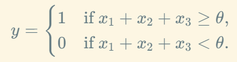

For an OR gate, the threshold ( $\theta$ ) is **1** because at least one input must be 1 for the output to be 1.

So the decision boundary is the equation:
$x_1 + x_2 + x_3 = \theta.$
Substituting $\theta = 1$ :
$x_1 + x_2 + x_3 = 1.$

This is the equation of the plane that separates the inputs into two regions:
- **Above or on the plane ( $x_1 + x_2 + x_3 \geq 1$ )**: Output is 1.
- **Below the plane ( $x_1 + x_2 + x_3 < 1$ )**: Output is 0.

---

### **McCulloch Pitt's Neuron ( OR )**


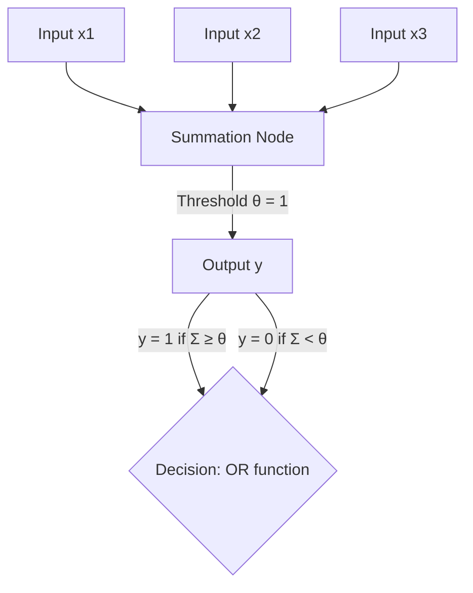

--- 

Q1. b. **Explain biological neurons.**

Ans .

**Biological Neurons in Deep Learning**  
Biological neurons inspire the structure and function of artificial neurons in Deep Learning. 

1. **Structure of Biological Neurons**:  
   - A neuron consists of *dendrites* (input), a *cell body* (processing), and an *axon* (output).  
   - Signals are transmitted via synapses using electrochemical processes.

2. **Signal Processing**:  
   - Dendrites receive signals, which are processed in the cell body. If the signal surpasses a threshold, the neuron fires an output through the axon.

3. **Inspiration for Artificial Neurons**:  
   - Artificial neurons mimic biological neurons by summing inputs, applying weights (analogous to synaptic strength), and generating an output based on an activation function (similar to firing thresholds).

4. **Neural Networks in Deep Learning**:  
   - Artificial neural networks are interconnected layers of artificial neurons, modeled after the connectivity and parallel processing of biological neurons.

5. **Learning Mechanism**:  
   - Similar to synaptic plasticity in biological neurons (learning by strengthening/weakened synapses), Deep Learning adjusts weights using optimization algorithms like backpropagation.


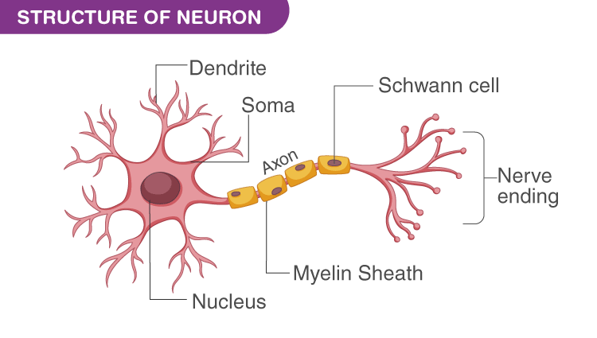

---

Q1. c. **Explain the Adam optimization algorithm.**

Ans. 

### **Adam Optimization Algorithm**  
Adam (Adaptive Moment Estimation) is a popular optimization algorithm in Deep Learning, combining the benefits of Momentum and RMSProp. Here's a concise explanation:  

1. **Key Idea**:  
   - Adam maintains per-parameter learning rates using estimates of first (mean) and second (variance) moments of gradients to adaptively update model parameters.

2. **Formulas**:  
   - **Moment Estimates**:  
     - $m_t = \beta_1 m_{t-1} + (1 - \beta_1) g_t$  (Exponential moving average of gradients).  
     - $v_t = \beta_2 v_{t-1} + (1 - \beta_2) g_t^2$  (Exponential moving average of squared gradients).  
   - **Bias Correction**:  
     - $\hat{m}_t = \frac{m_t}{1 - \beta_1^t}$ , $\hat{v}_t = \frac{v_t}{1 - \beta_2^t}$ .  
   - **Parameter Update**:  
     - $\theta_t = \theta_{t-1} - \frac{\alpha \hat{m}_t}{\sqrt{\hat{v}_t} + \epsilon}$ .

3. **Hyperparameters**:  
   - Learning rate $\alpha$ , $\beta_1$  (default 0.9), $\beta_2$  (default 0.999), and $\epsilon$  (default $10^{-8}$ ) for numerical stability.

4. **Advantages**:  
   - Combines advantages of Momentum (smooth convergence) and RMSProp (adaptive learning rates).  
   - Works well for sparse gradients and non-stationary objectives.

5. **Applications**:  
   - Widely used in training deep neural networks due to its efficiency and robustness to hyperparameter tuning.  


--- 

Q1. d. **Explain McCulloch Pitts Neuron model.**

Ans. 

### **McCulloch-Pitts Neuron Model**  
The McCulloch-Pitts neuron is a simplified computational model of a biological neuron, proposed in 1943. It is foundational in the field of artificial neural networks.  

#### Key Features:  

1. **Structure**:  
   - Consists of **inputs**, **weights**, and a **threshold**.  
   - Inputs are binary ($0$  or $1$ ), and weights determine the importance of each input.  

2. **Summation**:  
   - Calculates the weighted sum of inputs:  
     $\text{Net Input} = \sum_{i=1}^n (w_i \cdot x_i)$  
     where $x_i$  are inputs, and $w_i$  are weights.  

3. **Activation Function**:  
   - Compares the net input to a fixed **threshold** ($T$ ):  
     $\text{Output} = 
     \begin{cases} 
     1 & \text{if Net Input} \geq T \\ 
     0 & \text{otherwise} 
     \end{cases}$  
   - This step mimics a binary "firing" mechanism.  

4. **Binary Outputs**:  
   - The output is also binary ($0$  or $1$ ), representing whether the neuron "fires" or not.  

5. **Logical Computation**:  
   - It models simple logical operations like AND, OR, and NOT using specific configurations of weights and thresholds.  

**Limitations**:  
- **Linear Separation**: Cannot handle problems requiring non-linear decision boundaries (e.g., XOR problem).  
- **Static Weights**: Does not include learning mechanisms like weight adjustments seen in modern neural networks.  


---

Q2. a. **Explain activation functions which can be used at the output layer of deep neural network?**

Ans. 

### **Activation Functions**  

**Regression Tasks**:
- For regression tasks where the goal is to predict a continuous value, often the output layer has a linear activation function. This allows the network to produce unbounded real values as output.

**Binary Classification**:
- In binary classification problems, where the output is a binary decision (0 or 1), the sigmoid activation function is commonly used. It squashes the output values to the range [0, 1], which can be interpreted as probabilities.

**Multi-Class Classification**:
- For multi-class classification tasks where the goal is to classify inputs into more than two classes, the softmax activation function is often used. Softmax converts the network's output into a probability distribution over multiple classes.


---


1. **Sigmoid Activation Function**  
   - **Formula**:  
     $\sigma(x) = \frac{1}{1 + e^{-x}}$  
   - **Range**: (0, 1).  
   - **Use Case**: Binary classification problems where output represents probabilities.  
   - **Drawback**: Prone to vanishing gradient issues during backpropagation.

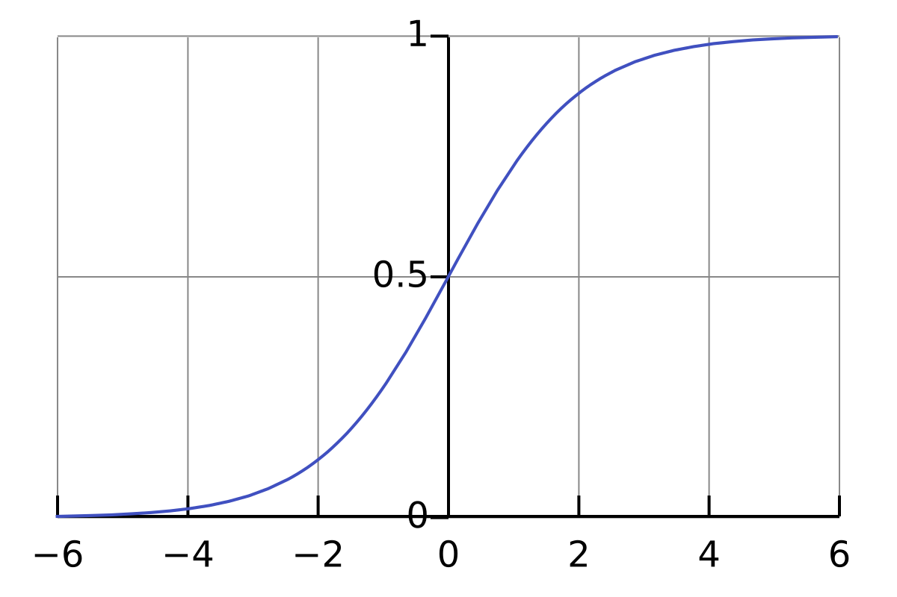


2. **Softmax Activation Function**  
   - **Formula**:  
     $\text{Softmax}(x_i) = \frac{e^{x_i}}{\sum_{j=1}^{n} e^{x_j}}$  
   - **Range**: (0, 1), and the outputs sum to 1.  
   - **Use Case**: Multiclass classification tasks to interpret outputs as probabilities.  

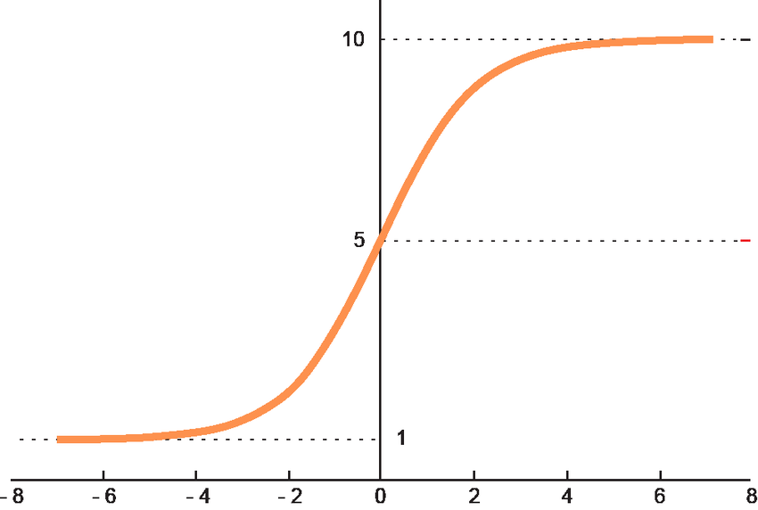

3. **Linear Activation Function**  
   - **Formula**:  
     $f(x) = x$  
   - **Range**: All real numbers ($-\infty, \infty$ ).  
   - **Use Case**: Regression problems where continuous values are predicted.  
   - **Advantage**: Allows unrestricted output values.  

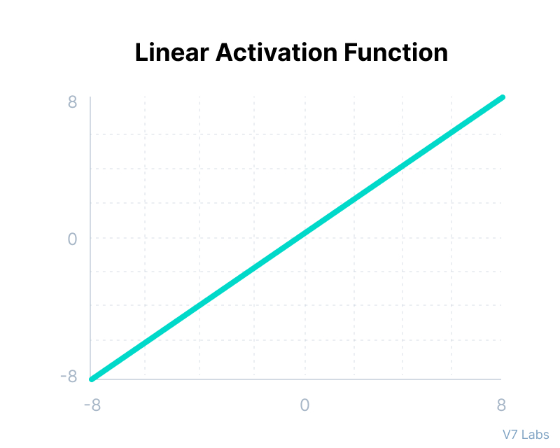

4. **Tanh (Hyperbolic Tangent) Activation Function**  
   - **Formula**:  
     $\text{Tanh}(x) = \frac{e^x - e^{-x}}{e^x + e^{-x}}$  
   - **Range**: (-1, 1).  
   - **Use Case**: Outputs requiring normalized values around 0.  
   - **Drawback**: Similar to Sigmoid, it can suffer from vanishing gradients.  

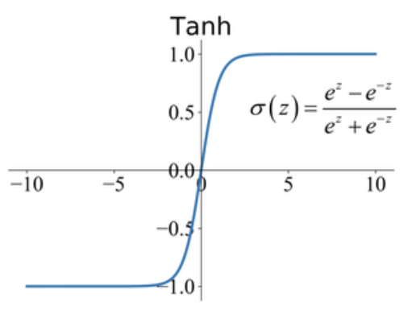

5. **ReLU (Rectified Linear Unit) Activation Function**  
   - **Formula**:  
     $\text{ReLU}(x) = \max(0, x)$  
   - **Range**: [0, $\infty$ ).  
   - **Use Case**: Occasionally used in output layers for tasks like image pixel intensity prediction.  
   - **Limitation**: Outputs non-negative values only, limiting its utility in specific cases.  

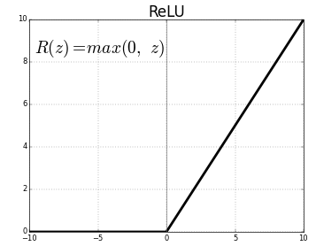

6. **Leaky ReLU (Rectified Linear Unit) Activation Function**  

   - **Formula**:  
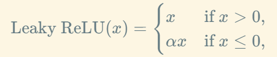
   - **Range**:  
   $(- \infty, \infty)$ .  

   - **Use Case**:  
     - Applied in hidden layers of deep neural networks to address the "dying ReLU" problem, where neurons become inactive for negative inputs.  

   - **Advantage**:  
     - Unlike standard ReLU, Leaky ReLU allows small gradients for negative inputs, preventing the network from completely ignoring these inputs.  

   - **Limitation**:  
     - The slope $\alpha$  for negative values is fixed and may not always be optimal for all datasets or tasks.  

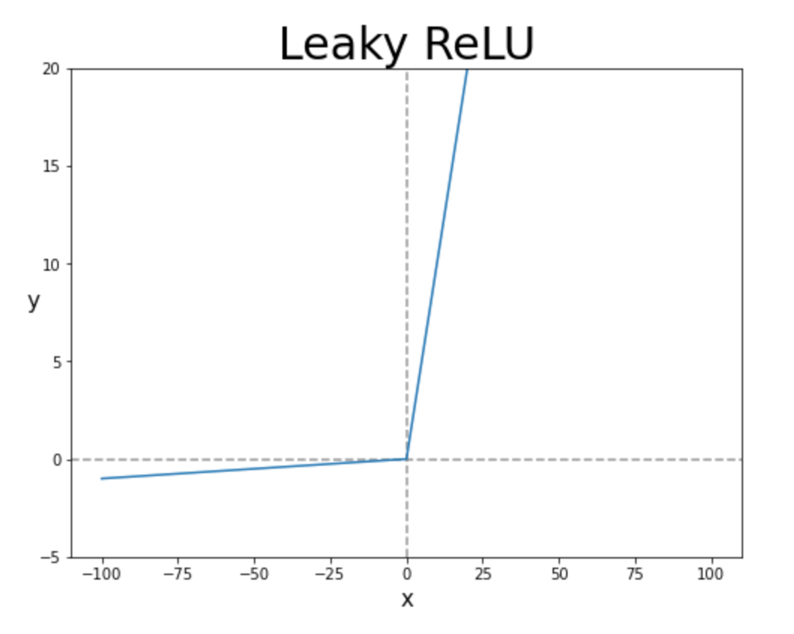

Each activation function is selected based on the nature of the task, ensuring compatibility with the desired output range and type.


---


Q2. b. **List the specific multimedia inputs given to the following neural Learning applications and name the outputs generated by these application.**
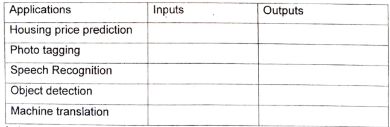

Ans. 

Here’s the completed table based on typical inputs and outputs for the given applications:

| **Applications**          | **Inputs**                               | **Outputs**                             |
|---------------------------|------------------------------------------|-----------------------------------------|
| Housing Price Prediction  | Home features (size, location, etc.) | Predicted housing price   |
| Photo Tagging             | Image data                               | Labeled tags or categories (1,....,1000)             |
| Speech Recognition        | Audio data                               | Text transcription                     |
| Object Detection          | Image or video data, RADAR info                      | Position of detected objects with bounding boxes   |
| Machine Translation       | Text in source language (say, English)                  | Text in target language (say, Marathi)                |

1. **Housing Price Prediction**:  
   - Inputs like house size, location, and features are fed into a regression model.  
   - The model predicts the house price by learning the relationships between input features and prices.  

2. **Photo Tagging**:  
   - Images are analyzed using a convolutional neural network (CNN).  
   - The network identifies patterns and assigns tags based on learned features (e.g., faces, objects).  

3. **Speech Recognition**:  
   - Audio signals are converted into spectrograms and processed by recurrent or transformer models.  
   - The model generates text by mapping audio patterns to words using language models.  

4. **Object Detection**:  
   - Image features are extracted using CNNs, and bounding box regressors locate objects.  
   - Detected objects are classified and localized with bounding boxes.  

5. **Machine Translation**:  
   - Source text is encoded using a sequence-to-sequence or transformer model.  
   - The model decodes the representation to generate equivalent text in the target language.  

---

Q2. c. **Let us consider a Convolutional Neural Network having three different convolutional layers in its architecture as**
- **Layer-1: Filter Size - 3 X 3, Number of Filters 10, Stride 1, Padding - 0**
- **Layer-2: Filter Size - 5 X 5, Number of Filters - 20, Stride 2, Padding - 0**
- **Layer-3: Filter Size - 5 X5, Number of Filters - 40, Stride 2, Padding - 0**

**If we give the input a 3-D image to the network of dimension 39 X 39, then determine the dimension of the vector after passing through a fully connected layer in the architecture. Draw architectural diagram.**
Ans.


We calculate the output dimensions after each layer of the convolutional neural network:

1. **Input Dimensions**  
   - Input: $39 \times 39 \times 3$  (Height $H$ , Width $W$ , Channels $C$ ).

2. **Layer 1**  
   - **Filter Size**: $3 \times 3$ , **Number of Filters**: $10$ , **Stride**: $1$ , **Padding**: $0$ .  
   - **Output Dimensions**:
     $H' = \frac{H - F + 2P}{S} + 1 = \frac{39 - 3 + 0}{1} + 1 = 37$
     $W' = \frac{W - F + 2P}{S} + 1 = \frac{39 - 3 + 0}{1} + 1 = 37$
   - Channels: $10$ .  
   - **Output**: $37 \times 37 \times 10$ .

3. **Layer 2**  
   - **Filter Size**: $5 \times 5$ , **Number of Filters**: $20$ , **Stride**: $2$ , **Padding**: $0$ .  
   - **Output Dimensions**:
     $H' = \frac{H - F + 2P}{S} + 1 = \frac{37 - 5 + 0}{2} + 1 = 17$
     $W' = \frac{W - F + 2P}{S} + 1 = \frac{37 - 5 + 0}{2} + 1 = 17$
   - Channels: $20$ .  
   - **Output**: $17 \times 17 \times 20$ .

4. **Layer 3**  
   - **Filter Size**: $5 \times 5$ , **Number of Filters**: $40$ , **Stride**: $2$ , **Padding**: $0$ .  
   - **Output Dimensions**:
     $H' = \frac{H - F + 2P}{S} + 1 = \frac{17 - 5 + 0}{2} + 1 = 7$
     $W' = \frac{W - F + 2P}{S} + 1 = \frac{17 - 5 + 0}{2} + 1 = 7$
   - Channels: $40$ .  
   - **Output**: $7 \times 7 \times 40$ .

5. **Fully Connected Layer**  
   - The output of Layer 3 is flattened into a 1D vector:  
     $7 \times 7 \times 40 = 1960$
   - This vector is passed to the fully connected layer, where the dimension depends on the number of neurons in the fully connected layer. If unspecified, the fully connected layer's output is typically a vector of size equal to the number of classes or desired outputs.


---

Q3. a. **What is Deep Learning and explain the unique characteristics of Deep Learning?**


Ans. 
### **What is Deep Learning?**

Deep Learning is a subset of Machine Learning that involves the use of artificial neural networks (ANNs) with many layers (hence the term "deep") to model complex patterns in large amounts of data. It mimics the workings of the human brain to some extent, enabling machines to learn from data in a hierarchical manner. Deep learning is particularly effective in tasks such as image recognition, natural language processing, and speech recognition.

#### **Unique Characteristics of Deep Learning**

1. **Automatic Feature Extraction**:
   - In traditional Machine Learning, features (attributes) need to be manually selected and pre-processed. In Deep Learning, neural networks automatically learn features from raw data, eliminating the need for manual feature extraction.

2. **Scalability**:
   - Deep Learning models excel at processing large datasets, and their performance improves as the size of the dataset grows. This scalability allows deep learning to handle big data more effectively than traditional algorithms.

3. **Hierarchical Learning**:
   - Deep Learning models use layers of neurons to build a hierarchical representation of features. Each layer learns increasingly abstract features of the data, allowing the model to capture complex patterns and structures.

4. **End-to-End Learning**:
   - Deep Learning systems can learn directly from input data to the final output (e.g., from raw images to predictions) without needing intermediate steps. This end-to-end learning simplifies the model training process and improves efficiency.

5. **High Accuracy with Large Data**:
   - Deep Learning models, especially deep neural networks like Convolutional Neural Networks (CNNs) and Recurrent Neural Networks (RNNs), often achieve superior performance on tasks like image classification, speech recognition, and natural language processing, compared to traditional machine learning models.

6. **Ability to Learn Complex Patterns**:
   - Deep networks can model very complex functions and represent non-linear relationships in the data. This capacity allows them to solve problems with high complexity, such as object detection, facial recognition, and language translation.

7. **Generalization**:
   - Deep Learning models, when trained properly, generalize well to unseen data, making them robust to new, previously unobserved patterns, especially when trained on large, diverse datasets.


---


Q3. b. **What is use of gradient descent optimization algorithm? Explain gradient descent algorithm and it's types in detail.**

Ans. 

**Use of Gradient Descent Optimization Algorithm**

- Gradient Descent is an optimization algorithm used to minimize the loss function in machine learning and deep learning models. 
- The goal is to find the optimal parameters (weights and biases) that reduce the error between the predicted and actual values. 
- It is primarily used for training models, especially neural networks, by updating the model's parameters in the direction that reduces the loss function.

### **Gradient Descent Algorithm**

Gradient Descent works by iteratively adjusting the parameters of the model in order to minimize the loss function (a function that measures the error of the model’s predictions). The basic steps of the algorithm are as follows:

1. **Initialization**:  
   Initialize the parameters (weights and biases) randomly or using some heuristic method.
   
2. **Compute the Gradient**:  
   Compute the gradient of the loss function with respect to the model parameters. The gradient is a vector that points in the direction of the steepest ascent of the loss function.

3. **Update the Parameters**:  
   Update the parameters by subtracting the gradient (scaled by a learning rate) from the current values. The formula for updating the parameters is:
   $\theta = \theta - \eta \nabla J(\theta)$
   Where:
   - $\theta$  represents the parameters (weights and biases).
   - $\eta$  is the learning rate (a small positive value).
   - $\nabla J(\theta)$  is the gradient of the loss function with respect to the parameters.

4. **Repeat**:  
   Repeat the above steps until the model converges (i.e., the change in the loss function becomes very small or reaches a predefined number of iterations).

#### **Types of Gradient Descent**

1. **Batch Gradient Descent**  
   - **How it works**:  
     In Batch Gradient Descent, the model parameters are updated using the gradients computed over the entire training dataset. 
   - **Advantages**:  
     - It provides a stable and smooth convergence to the minimum because the gradient is computed over the whole dataset.
     - The convergence path is predictable and the updates are consistent.
   - **Disadvantages**:  
     - It can be very slow and computationally expensive, especially with large datasets, because the model has to process all the data before updating the parameters.
     - It might not be suitable for real-time or online learning.
   - **Formula**:  
     $\theta = \theta - \frac{\eta}{m} \sum_{i=1}^{m} \nabla J(\theta, x^{(i)}, y^{(i)})$
     Where $m$  is the number of training examples, and $x^{(i)}$ , $y^{(i)}$  are the input features and corresponding labels.

2. **Stochastic Gradient Descent (SGD)**  
   - **How it works**:  
     In Stochastic Gradient Descent, the model parameters are updated after each individual training example. Instead of computing the gradient over the entire dataset, it computes the gradient for a single randomly selected training example.
   - **Advantages**:  
     - Faster updates and can handle large datasets effectively.
     - It can escape local minima due to its noisier path (since it's updating based on one sample at a time).
   - **Disadvantages**:  
     - The updates can be noisy and lead to a more erratic convergence.
     - May not converge to the true global minimum, and might oscillate around the minimum.
   - **Formula**:  
     $\theta = \theta - \eta \nabla J(\theta, x^{(i)}, y^{(i)})$
     Where $x^{(i)}$ , $y^{(i)}$  is a single data point from the dataset.

3. **Mini-Batch Gradient Descent**  
   - **How it works**:  
     Mini-Batch Gradient Descent is a compromise between Batch Gradient Descent and Stochastic Gradient Descent. The model parameters are updated after computing the gradient on a small random subset (mini-batch) of the training data.
   - **Advantages**:  
     - More efficient than Batch Gradient Descent for large datasets, as it uses fewer data points per update.
     - Less noisy than SGD and provides faster convergence compared to both methods.
     - It can take advantage of hardware acceleration like GPUs.
   - **Disadvantages**:  
     - The choice of mini-batch size is crucial; a very small size could lead to noisy updates, while a very large size could cause it to behave like Batch Gradient Descent.
   - **Formula**:  
     $\theta = \theta - \frac{\eta}{m} \sum_{i=1}^{m} \nabla J(\theta, x^{(i)}, y^{(i)})$
     Where $m$  is the size of the mini-batch.

**Summary of Key Differences**

| Type of Gradient Descent      | Updates per Iteration        | Pros                              | Cons                             |
|-------------------------------|------------------------------|-----------------------------------|----------------------------------|
| **Batch Gradient Descent**     | Once per full dataset        | Stable convergence                | Slow and computationally expensive for large datasets |
| **Stochastic Gradient Descent**| Once per training example    | Faster updates, handles large datasets | Noisy convergence, oscillates around the minimum |
| **Mini-Batch Gradient Descent**| Once per mini-batch          | Balances speed and accuracy, more efficient | Requires tuning of mini-batch size |

**Conclusion**
Gradient Descent is a powerful optimization algorithm used to minimize loss functions and train machine learning models. Its different variations allow for flexibility in training, depending on the dataset size and the computational resources available. Each type—Batch, Stochastic, and Mini-Batch—has its strengths and weaknesses, and the choice depends on the specific problem and the data at hand.


---

Q3. c. **- Explain Learning Rate Scheduling in training neural network.**

Ans. 

### **Learning Rate Scheduling in Training Neural Networks**

**Learning Rate Scheduling** refers to adjusting the learning rate during training to improve convergence, avoid overshooting, and enhance model performance.

#### **Why Use Learning Rate Scheduling?**
- **Faster Convergence**: High learning rate initially for quick learning, then reduced for fine-tuning.
- **Avoid Local Minima**: Smaller rates help the model escape local minima.
- **Better Generalization**: Helps in achieving better results on unseen data.

#### **Types of Learning Rate Scheduling**

1. **Step Decay**
   - **How**: Reduces the learning rate by a fixed factor at regular intervals.
   - **Example**: Reduce by half every 10 epochs.
   - **Pros**: Simple.
   - **Cons**: Less flexible.

2. **Exponential Decay**
   - **How**: Learning rate decreases exponentially over time.
   - **Formula**: $\text{Learning Rate} = \text{Initial Rate} \times e^{-\text{decay rate} \times \text{epoch}}$ 
   - **Pros**: Smooth and continuous.
   - **Cons**: Needs careful tuning.

3. **Cosine Annealing**
   - **How**: Learning rate decreases following a cosine curve.
   - **Formula**: Gradual decrease from initial to minimum value.
   - **Pros**: Smooth decay.
   - **Cons**: May not suit all tasks.

4. **Reduce on Plateau**
   - **How**: Reduces the learning rate when the validation loss stops improving for several epochs.
   - **Pros**: Adaptive to model performance.
   - **Cons**: Requires monitoring.

5. **Cyclical Learning Rates**
   - **How**: Learning rate oscillates between a minimum and maximum value during training.
   - **Pros**: Can avoid local minima.
   - **Cons**: Needs tuning of bounds and cycles.

**Conclusion**
Learning rate scheduling enhances training efficiency by adapting the learning rate. Choosing the right method can improve convergence, avoid overfitting, and speed up learning.

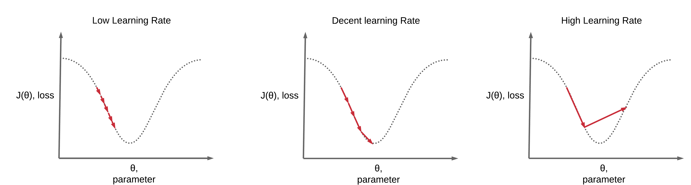

--- 

Q4. a. **Which activation functions can lead to vanishing gradients problem? What is vanishing gradient problem?**


Ans. 

### **Vanishing Gradient Problem**

The **vanishing gradient problem** occurs when the gradients of the loss function become very small during backpropagation, leading to very small weight updates in the early layers of a neural network. This causes the model to stop learning or converge very slowly, making it hard to train deep neural networks effectively.

#### **Activation Functions Leading to Vanishing Gradient Problem**

1. **Sigmoid Activation Function**
   - **How it leads to vanishing gradients**:  
     The sigmoid function squashes input values into a range between 0 and 1, causing its derivative to be very small for large positive or negative inputs. As a result, during backpropagation, the gradients can become extremely small, especially in deep networks, leading to poor weight updates.
   - **Example**:  
     If the input is far from 0 (either very positive or negative), the gradient of the sigmoid becomes very small (close to 0).

2. **Tanh Activation Function**
   - **How it leads to vanishing gradients**:  
     Similar to the sigmoid function, the tanh function squashes values into a range between -1 and 1. Its derivative also becomes very small for large positive or negative inputs. This causes small gradients during backpropagation in deep networks.
   - **Example**:  
     The gradient of tanh becomes very small as the output approaches -1 or 1, leading to small weight updates.

#### **Why Does the Vanishing Gradient Problem Occur?**
- Both sigmoid and tanh functions have **saturating regions** where the gradients become very small (near 0 or 1 for sigmoid, and near -1 or 1 for tanh).
- In deep networks, the gradients can decrease exponentially as they propagate backward, making it difficult for the earlier layers to learn effectively.

#### **Consequences of Vanishing Gradients**
- **Slow learning**: Training can take a long time as the weight updates become negligible.
- **Poor performance**: The network might fail to capture useful patterns in the data, especially in deeper layers.
- **Training stall**: The model may effectively stop learning if gradients are too small.

#### **Mitigating the Vanishing Gradient Problem**
- Use activation functions like **ReLU** (Rectified Linear Unit) or its variants, such as **Leaky ReLU**, which do not saturate and allow for larger gradients.
- Implement **Batch Normalization** to stabilize the learning process.
- Use **skip connections** or **ResNet architectures** to allow gradients to flow more easily through deeper networks.


---


Q4. b. **Explain the deep neural network concept of underfitting, overfitting and trade-off between them?**

Ans. 

### Bias / Variance Trade-off

#### Ensuring Proper Data Distribution
- **Distribution Consistency**: Make sure the distribution of the dev/test set is the same as the training set.
- **Data Splitting**: Divide the training, dev, and test sets in such a way that their distribution is similar.
- **Validation**: In some cases, skip the test set and validate the model using the dev set only.

---

#### Underfitting
**Definition**: Underfitting occurs when a model is too simple to capture the underlying patterns in the training data. This results in:
- **High training error**: The model cannot learn the training data well.
- **High validation error**: Poor performance on unseen data.

**Characteristics of Underfitting**:
- The model is too “simple” to represent all the relevant class characteristics.
  - Example: A model with too few parameters.
- Produces high error on both the training set and validation set.

**Examples of Underfitting**:
- Using a linear model to fit a highly non-linear dataset.
- Setting a low number of training epochs.

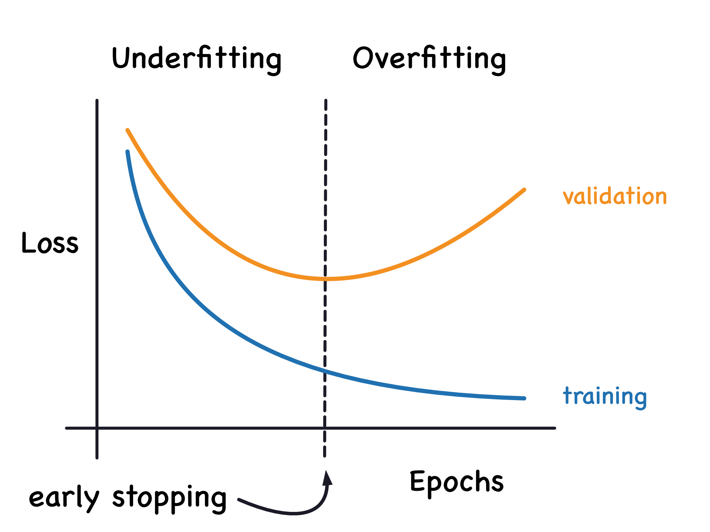

---

#### Overfitting
**Definition**: Overfitting occurs when a model is too complex and learns the training data too well, including noise and random fluctuations. This results in:
- **Low training error**: The model fits the training data very well.
- **High validation error**: Fails to generalize to new, unseen data.

**Characteristics of Overfitting**:
- The model is too “complex” and fits irrelevant characteristics (noise) in the data.
  - Example: A model with too many parameters.
- Produces low error on the training set and high error on the validation set.

**Causes of Overfitting**:
- Too many parameters relative to the amount of training data available.
- Training the model for too many epochs, leading to memorization of the training data.


--- 

#### The Trade-off Between Underfitting and Overfitting
**Objective**: The goal is to find the right balance between underfitting and overfitting, enabling the model to generalize well to unseen data.

**Managing the Trade-off**:
1. **Regularization**:
   - Introduce penalties for large weights or complex models to prevent overfitting.
   - Examples: L1 and L2 regularization, which add penalty terms to the loss function based on the magnitude of the weights.
2. **Model Selection**:
   - Choose a model architecture and hyperparameters that match the complexity of the underlying data.
   - Use techniques like cross-validation to assess how well the model generalizes to different subsets of the data.

By carefully tuning these parameters and monitoring performance on the dev set, we can achieve a model that performs well on both training and unseen data, striking the perfect balance between underfitting and overfitting.


--- 

Q4. c. **What types of Recurrent Neural Networks (RNN) do you know? Explain by giving example of each.**

Ans. 

Recurrent Neural Networks (RNNs) are a type of neural network designed for sequential data. They process inputs sequentially, maintaining a memory of past inputs to inform future outputs. There are various types of RNNs, each suited to specific tasks:

1. **Vanilla RNN**
- **Description**: The simplest form of RNN where the output at each time step depends on the current input and the hidden state from the previous time step.
- **Strengths**: Works well for short sequences.
- **Limitations**: Struggles with long-term dependencies due to vanishing gradients.
- **Example**:
  - Predicting the next word in a sentence based on previous words.
  - **Task**: Text prediction or completion.

2. **Long Short-Term Memory (LSTM)**
- **Description**: An advanced version of RNN with a gating mechanism (input gate, forget gate, and output gate) to manage long-term dependencies effectively.
- **Strengths**: Can capture long-term dependencies and handle vanishing gradient problems.
- **Example**:
  - Language translation (e.g., English to French).
  - **Task**: Sequence-to-sequence models for translation or text summarization.


3. **Gated Recurrent Unit (GRU)**
- **Description**: A simpler variant of LSTM that combines input and forget gates into a single update gate, making it computationally efficient while still managing long-term dependencies.
- **Strengths**: Similar performance to LSTM but faster to train.
- **Example**:
  - Sentiment analysis of customer reviews.
  - **Task**: Classifying sequences based on context.

4. **Bidirectional RNN**
- **Description**: Processes the sequence in both forward and backward directions, combining information from both past and future contexts.
- **Strengths**: Useful when the entire sequence is available and context from both directions is essential.
- **Example**:
  - Named Entity Recognition (NER) in text.
  - **Task**: Extracting entities like names, dates, and locations from text.


5. **Sequence-to-Sequence RNN**
- **Description**: Involves an encoder RNN to process input sequences and a decoder RNN to generate output sequences. Often combined with attention mechanisms.
- **Strengths**: Effective for input-output sequence transformations.
- **Example**:
  - Chatbots or conversational AI.
  - **Task**: Generating appropriate responses to user queries.

6. **Recursive Neural Network**
- **Description**: Unlike traditional RNNs, recursive neural networks operate on tree-like structures, useful for hierarchical data.
- **Strengths**: Excellent for tasks with structured input, like parse trees in NLP.
- **Example**:
  - Sentiment analysis for sentences with complex syntactic structures.
  - **Task**: Analyzing relationships between components of a sentence.

7. **Attention-Augmented RNN**
- **Description**: Combines RNNs with attention mechanisms to focus on relevant parts of the input sequence, improving long-range dependency modeling.
- **Strengths**: Handles large sequences efficiently and captures important sequence components.
- **Example**:
  - Summarizing long documents into concise descriptions.
  - **Task**: Text summarization or document classification.


--- 

Q5. a. **In multiclass classification problem, Z represents the values from the neurons of the output layer before applying activation function. Suppose the value of Z1, Z2, Z3 comes out to be 2.33, -1.46, and 0.56 respectively. 0.83 After applying the SoftMax activation function to each of these neurons and calculate probability distribution? Predict the given input will belong to which class?**

Ans. 

To calculate the probability distribution using the SoftMax activation function and determine the class to which the input belongs, follow these steps:

1. **SoftMax Activation Function**:
The SoftMax function for each neuron is defined as:
$P_i = \frac{e^{Z_i}}{\sum_{j} e^{Z_j}}$ 
where $P_i$  is the probability for class $i$ , $Z_i$  is the value from the output layer for class $i$ , and the sum is over all classes.

Given $Z_1 = 2.33$ , $Z_2 = -1.46$ , and $Z_3 = 0.56$ , calculate $e^{Z_1}$ , $e^{Z_2}$ , and $e^{Z_3}$ , then normalize them.

2. **Compute Exponentials**:
$e^{Z_1} = e^{2.33}, \quad e^{Z_2} = e^{-1.46}, \quad e^{Z_3} = e^{0.56}$ 

3. **Normalize Probabilities**:
$P_1 = \frac{e^{Z_1}}{e^{Z_1} + e^{Z_2} + e^{Z_3}}, \quad
P_2 = \frac{e^{Z_2}}{e^{Z_1} + e^{Z_2} + e^{Z_3}}, \quad
P_3 = \frac{e^{Z_3}}{e^{Z_1} + e^{Z_2} + e^{Z_3}}$ 

4. **Determine the Class**:
The class with the highest probability corresponds to the predicted output.

Let me calculate these values.

The SoftMax probabilities for each class are:

- $P_1 = 0.8383$ 
- $P_2 = 0.0189$ 
- $P_3 = 0.1428$ 

The predicted class is **Class 1** since it has the highest probability ($P_1 = 0.8383$ ).

---


Q5. b. **The following diagram depicts the RNN, where xt, ht-1, ht, and yt are all scalars, as a state machine. Suppose that f and g are the activation functions for the first layer, second layer hidden units and output respectively. g(x) is mod of x. Write the equations for the hidden states and output at each time step. Given input 0110 what is the output?** 
**Given that, W * 1 = 1 W * 2 = 1 , b * 2 = - 1 , W * 3 = 1 , b * 3 = 0 , W * 4 = 1 b * 4 = 0 and other parameters initialized to zero.**
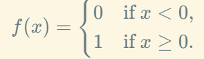

$g(x) = |x|$

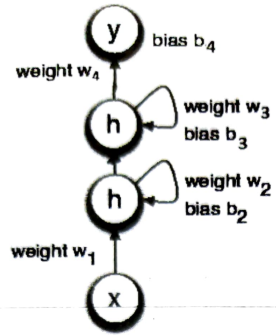

Ans. 

The diagram represents a simple Recurrent Neural Network (RNN) structure. Let's break this problem into steps:


**Given**:

- $g(x) = |x|$ : Absolute value of $x$ .
- Weights and biases:
  - $W_1 = 1$ , $W_2 = 1$ , $b_2 = -1$ ,
  - $W_3 = 1$ , $b_3 = 0$ ,
  - $W_4 = 1$ , $b_4 = 0$ ,
  - Initial hidden state $h_{t-1} = 0$ .


#### Hidden State Equation
At each time step $t$ , the hidden state $h_t$  is given by:
$h_t = f(W_1 x_t + W_2 h_{t-1} + b_2)$ 

---

#### Output Equation
The output $y_t$  at each time step is given by:
$y_t = g(W_3 h_t + b_3)$ 

Substitute $g(x) = |x|$ :
$y_t = |W_3 h_t + b_3|$ 

---

#### Process the Input Sequence
The input sequence is $x = [0, 1, 1, 0]$ . We'll calculate $h_t$  and $y_t$  for each time step.

1. **For $t = 1$ :**
   $h_1 = f(W_1 x_1 + W_2 h_0 + b_2)$
   $h_1 = f(1 \cdot 0 + 1 \cdot 0 - 1) = f(-1) = 0$
   $y_1 = |W_3 h_1 + b_3| = |1 \cdot 0 + 0| = 0$

2. **For $t = 2$ :**
   $h_2 = f(W_1 x_2 + W_2 h_1 + b_2)$
   $h_2 = f(1 \cdot 1 + 1 \cdot 0 - 1) = f(0) = 1$
   $y_2 = |W_3 h_2 + b_3| = |1 \cdot 1 + 0| = 1$

3. **For $t = 3$ :**
   $h_3 = f(W_1 x_3 + W_2 h_2 + b_2)$
   $h_3 = f(1 \cdot 1 + 1 \cdot 1 - 1) = f(1) = 1$
   $y_3 = |W_3 h_3 + b_3| = |1 \cdot 1 + 0| = 1$

4. **For $t = 4$ :**
   $h_4 = f(W_1 x_4 + W_2 h_3 + b_2)$
   $h_4 = f(1 \cdot 0 + 1 \cdot 1 - 1) = f(0) = 1$
   $y_4 = |W_3 h_4 + b_3| = |1 \cdot 1 + 0| = 1$


#####  Output Sequence
The output sequence is:
$y = [0, 1, 1, 1]$ 

Let me know if you'd like further clarification!

---

Q5. c. **Explain ResNets. What problem does it solve? Explain in detail any one block of it.**

Ans. 

### Residual Networks (ResNets)

#### Overview
Residual Networks (ResNets) are a type of deep neural network architecture introduced to address the challenges associated with training very deep neural networks. ResNets were first introduced in the paper *"Deep Residual Learning for Image Recognition"* by He et al. in 2015. ResNets became revolutionary by enabling the training of networks with hundreds or even thousands of layers, which were previously difficult to train effectively.

---

**Problem Solved by ResNets**
1. **Vanishing/Exploding Gradients Problem:**
   - In very deep networks, the gradients during backpropagation can become too small (vanishing) or too large (exploding), making it hard for the network to converge.
   - ResNets solve this issue by using **residual connections** (or skip connections), allowing gradients to flow more easily through the network.

2. **Degradation Problem:**
   - As the depth of a neural network increases, its performance starts degrading (even if overfitting is not an issue). This is because deeper networks struggle to learn identity mappings (i.e., learning that an input is the same as the output in some layers).
   - ResNets address this by explicitly learning residual mappings, making it easier for deeper networks to learn identity mappings when needed.


**Key Idea of ResNets: Residual Learning**
Instead of trying to learn the desired mapping $H(x)$  directly, ResNets learn the **residual mapping** $F(x) = H(x) - x$ . This means:
$H(x) = F(x) + x$ 
where:
- $x$ : Input to a layer
- $F(x)$ : Residual mapping learned by the network
- $H(x)$ : Final desired output of the layer

By reformulating the problem in this way, the network learns the residuals, which are often easier to optimize than the direct mapping.


**Structure of a ResNet Block**
A ResNet is built using **residual blocks**, which are the fundamental units of the architecture.

**Basic Residual Block**
The basic residual block consists of:
1. Two convolutional layers with a ReLU activation function.
2. A **skip connection** that bypasses these layers and adds the input directly to the output.

**Mathematical Representation:**
$y = F(x, \{W_i\}) + x$ 
where:
- $x$ : Input
- $F(x, \{W_i\})$ : Transformation applied to $x$  (e.g., convolution, batch normalization, and activation)
- $y$ : Output of the block
- $W_i$ : Weights of the convolution layers


**Detailed Explanation of a Basic Residual Block**
1. **Input:** The input $x$  is fed into the block.
2. **First Convolution:** A convolution layer applies filters to the input, followed by Batch Normalization and a ReLU activation.
3. **Second Convolution:** Another convolution layer is applied to the output of the first, followed by Batch Normalization.
4. **Skip Connection:** The original input $x$  is added to the output of the second convolution (element-wise addition).
5. **Output:** The result is passed to the next layer.

**Diagram:**
```
Input (x)
   │
   ├──> [Conv → BatchNorm → ReLU → Conv → BatchNorm] ──┐
   │                                                  │
   └──────────────────────────(Skip Connection)──────> Add → Output
```

**Bottleneck Residual Block**
For deeper ResNets, **bottleneck residual blocks** are used to reduce computational complexity. These blocks compress the feature dimensions before performing expensive convolutions and then expand them back.

1. **Structure:**
   - A 1x1 convolution reduces dimensions.
   - A 3x3 convolution performs the core operation.
   - Another 1x1 convolution restores dimensions.
   - Skip connection is added as usual.

**Benefits of ResNets**
1. **Easier Optimization:**
   - Skip connections mitigate the vanishing gradient problem by allowing gradients to flow directly through the network.
2. **Improved Accuracy:**
   - ResNets outperform traditional deep networks in tasks like image classification and object detection.
3. **Identity Mapping:**
   - Learning identity mappings in deeper layers ensures that adding more layers does not degrade performance.
4. **Flexibility:**
   - ResNet architecture can be scaled to extremely deep networks (e.g., ResNet-50, ResNet-101, ResNet-152).


**Example Use Case: ResNet-50**
ResNet-50 is a commonly used version with 50 layers. It uses:
- Basic residual blocks for the initial layers.
- Bottleneck blocks for deeper layers.
- Skip connections throughout to preserve gradient flow.


--- 


#### **Q1.**  
**a. Explain McCulloch Pitts Neuron Model.** *(5 Marks)*  

**Answer:**  


---

**b. Explain the RMSprop optimization algorithm.** *(5 Marks)*  

**Answer:**  

---

**c. What are the applications of a Deep Neural Network (DNN)? Explain any two in detail.** *(5 Marks)*  

**Answer:**  

---

**d. Explain any one unsupervised learning network.** *(5 Marks)*  

**Answer:**  

---

#### **Q2.**  
**a. What is regularization in deep learning?** *(2 Marks)*  

**Answer:**  

---

**b. Explain two ways to deal with the vanishing gradient problem in a Deep Neural Network.** *(2 Marks)*  

**Answer:**  

---

**c. What are the differences between Machine Learning and Deep Learning?** *(4 Marks)*  

**Answer:**  

---

**d. Which are different techniques of regularization in deep learning? Explain any two regularization techniques.** *(10 Marks)*  

**Answer:**  

---

#### **Q3.**  
**a. Explain the deep neural network concept of underfitting, overfitting, and the trade-off between them.** *(6 Marks)*  

**Answer:**  

---

**b. What is the use of Gradient Descent optimization algorithm? Explain Gradient Descent algorithm in detail.** *(6 Marks)*  

**Answer:**  

---

**c. Give an example of learning the XOR function with a multilayer neural network. Assume random initialization of weights.** *(8 Marks)*  

**Answer:**  

---

#### **Q4.**  
**a. Can we use CNN to perform Dimensionality Reduction? If yes, then which layer is responsible for dimensionality reduction particularly in CNN?** *(8 Marks)*  

**Answer:**  

---

**b. Explain the different types of layers in CNN.** *(8 Marks)*  

**Answer:**  

---

**c. What is ResNets? What problem does it solve? Explain in detail any one block of it.** *(10 Marks)*  

**Answer:**  

---


