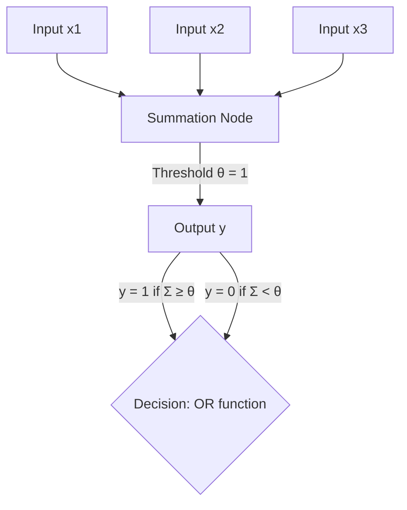

#  Deep Learning ESE 
> Author : Aaron Augustine

> Star the gist so that I can get a consensus on how many people are using this resource
> 
[Github Repo Link for all ESE Notes](https://github.com/ToothlessRider/Sem_3_Notes.git)

# Table of Contents
- [Deep Learning ESE](#deep-learning-ese)
- [Table of Contents](#table-of-contents)
  - [Previous Year Questions](#previous-year-questions)
    - [**OR Function**](#or-function)
    - [**McCulloch Pitt's Neuron ( OR )**](#mcculloch-pitts-neuron--or-)

## Previous Year Questions

Q1. a. **Draw a decision boundary of OR function, when given x1, x2 and x3 inputs to the McCulloch Pitts Neuron. Also write an equation of that decision boundary**

Ans. 

To create a decision boundary for the **OR** function implemented using a McCulloch-Pitts neuron with three inputs ($x_1$, $x_2$, $x_3$), we consider the following steps:

### **OR Function**
The output of the OR function is defined as:
$y = \begin{cases} 
1 & \text{if } x_1 + x_2 + x_3 \geq \theta, \\
0 & \text{otherwise.}
\end{cases}$

For an OR gate, the threshold ( $\theta$ ) is **1** because at least one input must be 1 for the output to be 1.

So the decision boundary is the equation:
$x_1 + x_2 + x_3 = \theta.$
Substituting $\theta = 1$ :
$x_1 + x_2 + x_3 = 1.$

This is the equation of the plane that separates the inputs into two regions:
- **Above or on the plane ( $x_1 + x_2 + x_3 \geq 1$ )**: Output is 1.
- **Below the plane ( $x_1 + x_2 + x_3 < 1$ )**: Output is 0.

---

### **McCulloch Pitt's Neuron ( OR )**

--- 

Q1. b. **Explain biological neurons.**

Ans .

---

Q1. c. **Explain the Adam optimization algorithm.**

Ans. 

--- 

Q1. d. **Explain McCulloch Pitts Neuron model.**

Ans. 

---

Q2. a. **Explain activation functions which can be used at the output layer of deep neural network?**

Ans. 

---

Q2. b. **List the specific multimedia inputs given to the following neural Learning applications and name the outputs generated by these application.**

Ans. 

---

Q2. c. **Let us consider a Convolutional Neural Network having three different convolutional layers in its architecture as**
- **Layer-1: Filter Size - 3 X 3, Number of Filters 10, Stride 1, Padding - 0**
- **Layer-2: Filter Size - 5 X 5, Number of Filters - 20, Stride 2, Padding - 0**
- **Layer-3: Filter Size - 5 X5, Number of Filters - 40, Stride 2, Padding - 0**

**If we give the input a 3-D image to the network of dimension 39 X 39, then determine the dimension of the vector after passing through a fully connected layer in the architecture. Draw architectural diagram.**
Ans.

---

Q3. a. **What is Deep Learning and explain the unique characteristics of Deep Learning?**

Ans. 

---

Q3. b. **What is use of gradient descent optimization algorithm? Explain gradient descent algorithm and it's types in detail.**

Ans. 

---

Q3. c. **- Explain Learning Rate Scheduling in training neural network.**

Ans. 

--- 

Q4. a. **Which activation functions can lead to vanishing gradients problem? What is vanishing gradient problem?**

Ans. 

---

Q4. b. **Explain the deep neural network concept of underfitting, overfitting and trade-off between them?**

Ans. 

--- 

Q4. c. **What types of Recurrent Neural Networks (RNN) do you know? Explain by giving example of each.**

Ans. 

--- 

Q5. a. **In multiclass classification problem, Z represents the values from the neurons of the output layer before applying activation function. Suppose the value of Z1, Z2, Z3 comes out to be 2.33, -1.46, and 0.56 respectively. 0.83 After applying the SoftMax activation function to each of these neurons and calculate probability distribution? Predict the given input will belong to which class?**

Ans. 

---

Q5. b. **The following diagram depicts the RNN, where xt, ht-1, ht, and yt are all scalars, as a state machine. Suppose that f and g are the activation functions for the first layer, second layer hidden units and output respectively. g(x) is mod of x. Write the equations for the hidden states and output at each time step. Given input 0110 what is the output?** 
**Given that, W * 1 = 1 W * 2 = 1 , b * 2 = - 1 , W * 3 = 1 , b * 3 = 0 , W * 4 = 1 b * 4 = 0 and other parameters initialized to zero.**
$f(x) = 
\begin{cases} 
0 & \text{if } x < 0, \\
1 & \text{if } x \geq 0.
\end{cases}$

$g(x) = |x|$

Ans. 

---

Q5. c. **Explain ResNets. What problem does it solve? Explain in detail any one block of it.**

Ans. 

--- 

